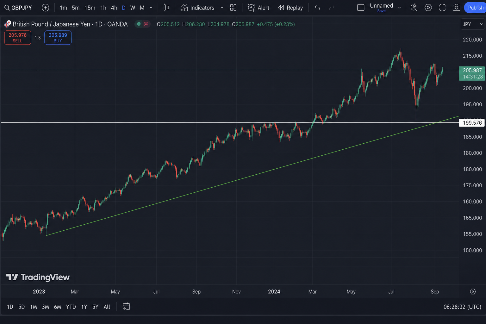
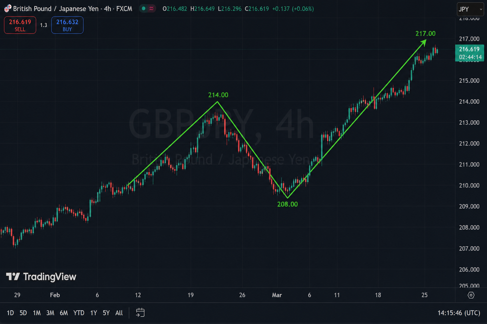
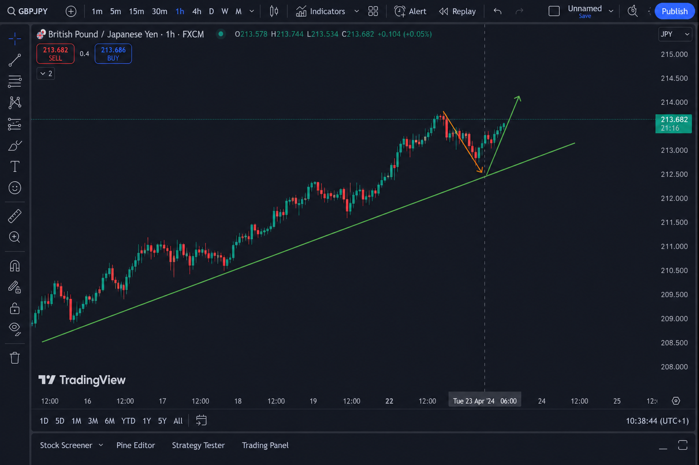
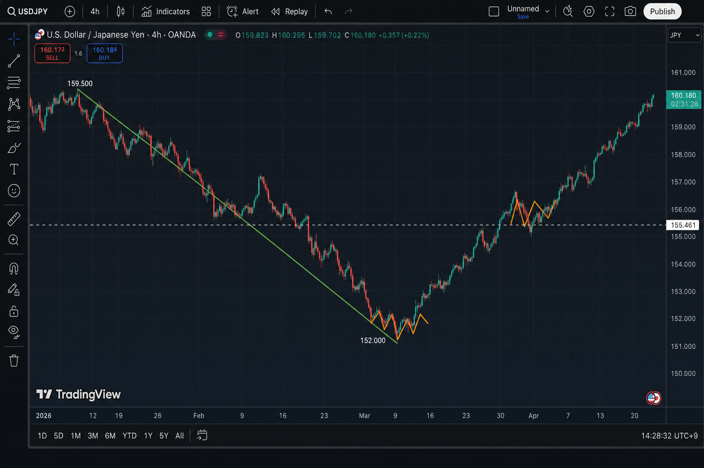
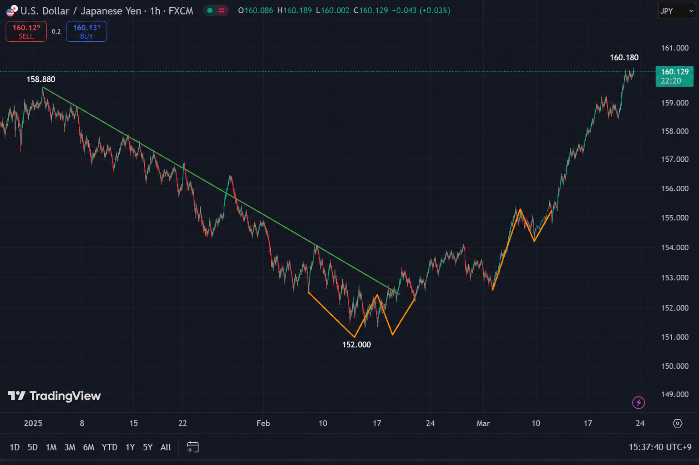
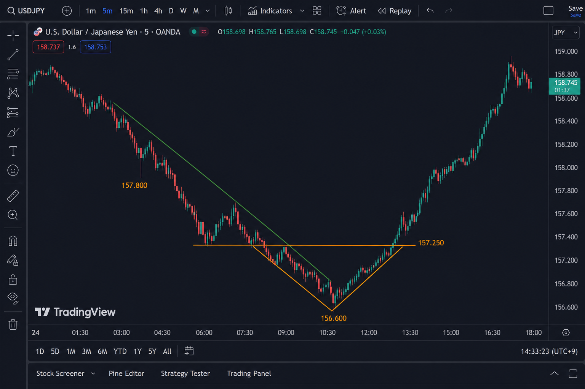

# 仮説メモ: 上位足の押し目 ＝ 下位足の転換

作成日: 2026-06-08  
更新: 2026-06-08（USDJPY 事例・チャート画像追加）  
状態: **気づき・仮説**（バックテスト未実施）

## 研究の問い

**上位足で「押し目」と見える区間が、下位足では明確な「転換（トレンド反転）」として読める場所は、エントリー精度が高いか？**

---

## 核心の気づき

> **上位足から下位足へマルチタイムフレーム（MTF）で見ていくと、転換点がはっきり見える。**

| 見方 | 見え方 |
|---|---|
| **上位足だけ** | 「押し目っぽい」— **どこで止まるか不明** |
| **下位足に降りる** | 押し目の中身 = **小型トレンド → 転換** が構造として見える |
| **さらに下位足（M5等）** | 転換の **首（neckline）ブレイク** まで追える |

**読み方の順序:** 上位足でゾーン特定 → 下位足で転換待ち → 最下位足でエントリー精度

---

## 事例1: GBPJPY（D1 → H4 → H1）

### D1 — 大局的な押し目ゾーン



- 長期上昇（156→213 付近）
- 緑サポートライン沿い
- 節目 **189.576**（過去抵抗）

### H4 — 押し目1 leg（V字）



- 高値 **214** → 安値 **208** → 再上昇
- 上位足では **押し目1本**

### H1 — 押し目の中身 = 転換



- オレンジ zigzag = 小型下降（lower high / lower low）
- 緑 = **転換**（安値更新停止 → 再上昇）
- TradingView メモ: *抵抗線付近まで抜けたけれどダマシになってもどってきた。そのあと上昇すれば長…*

---

## 事例2: USDJPY（H4 → H1 → M5）

保有中の **USDJPY 買い50**（4HT5）と同方向の構造例。

### H4 — 急落後の押し目・反転 leg



- **159.5 → 152** 急落（緑下降ライン）
- 底値圏で **オレンジ zigzag**（転換）
- 3月の **押し目**（156 付近）→ 現在 **160.18** 付近まで回復

### H1 — 押し目内部の転換



- 152 底: オレンジ zigzag で **転換**
- 3月押し目: 再びオレンジ zigzag → 上昇再開

### M5 — 転換点の精密視



- 緑下降 **157.8 → 156.6**
- オレンジ **V字転換** + 首 **157.25** ブレイク
- → **158.8+** への leg（下位足でエントリー候補が見える）

---

## 仮説（v0.1）

### 構造

```
上位足:  トレンド ──╲  押し目（1 leg）
                    ╲
下位足:   逆方向 zigzag ──╲  ← 小型トレンド
                          ● 転換 ← CHECK
                           ╱
上位足:                  ╱  leg 再開
最下位足:               首ブレイクで GO 候補
```

### 心理

| 時間足 | 参加者 | 行動 |
|---|---|---|
| 上位足 | 「押し目だが場所不明」 | **WAIT** |
| 下位足 | 小型逆方向トレンド中 | 飛び乗り禁止 |
| 重なり | サポート + 転換 | **CHECK** |
| M5/M15 | 首ブレイク | **GO 候補**（SL=転換 low 下） |

### GBPJPY 6/4 との対比

| | 6/4 投げ切り買い | MTF ルール |
|---|---|---|
| 上位足 | 押し目候補 | ✅ |
| 下位足転換 | **未確認** | ❌ WAIT 止まり |
| 結果 | -11.2万（出口OCOは正解） | — |

---

## MTF 読み方チェックリスト

1. **上位足（D1/H4）**: トレンド方向 + 押し目ゾーンをマーク
2. **中位足（H1）**: 押し目内部の zigzag / 転換を探す
3. **下位足（M5/M15）**: 転換の首・SL 位置を決める
4. **エントリー**: 転換確認後のみ（投げ切り単独禁止 E01）
5. **出口**: SL=下位足転換点、TP=上位足の次の節目

---

## 操作定義（検証用ドラフト）

| # | 上位足 | 下位足 |
|---|---|---|
| 1 | トレンド明確（20MA 等） | — |
| 2 | 押し目 leg ≥ X ATR | 同期間に逆方向 zigzag |
| 3 | サポート/トレンドライン ±Y ATR | — |
| 4 | — | 転換（higher low + high ブレイク） |
| 5 | — | M5/M15 で首ブレイク（任意・精度向上） |

---

## 検証ロードマップ

| 段階 | 内容 | 状態 |
|---|---|---|
| 1 | 事例スクショセット | **GBPJPY 3枚 + USDJPY 3枚** ✅ |
| 2 | 転換あり vs なし MAE/MFE | 未着手 |
| 3 | Pine MTF ラベル | 未着手 |
| 4 | signal_review MTF 項目 | ✅ 追記済み |

---

## チャート画像一覧

| ファイル | 銘柄 | TF |
|---|---|---|
| [2026-06-08_gbpjpy_d1_pullback_context.png](images/mtf_pullback_reversal/2026-06-08_gbpjpy_d1_pullback_context.png) | GBPJPY | D1 |
| [2026-06-08_gbpjpy_h4_pullback_context.png](images/mtf_pullback_reversal/2026-06-08_gbpjpy_h4_pullback_context.png) | GBPJPY | H4 |
| [2026-06-08_gbpjpy_h1_reversal_detail.png](images/mtf_pullback_reversal/2026-06-08_gbpjpy_h1_reversal_detail.png) | GBPJPY | H1 |
| [2026-06-08_usdjpy_h4_pullback_context.png](images/mtf_pullback_reversal/2026-06-08_usdjpy_h4_pullback_context.png) | USDJPY | H4 |
| [2026-06-08_usdjpy_h1_reversal_detail.png](images/mtf_pullback_reversal/2026-06-08_usdjpy_h1_reversal_detail.png) | USDJPY | H1 |
| [2026-06-08_usdjpy_m5_reversal_entry.png](images/mtf_pullback_reversal/2026-06-08_usdjpy_m5_reversal_entry.png) | USDJPY | M5 |

---

## 関連

| 種類 | パス |
|---|---|
| シグナル判断 | [signal_review_protocol.md](../trade_diary/reference/signal_review_protocol.md) |
| 3段下降（逆方向） | [stair_step_decline_hypothesis_2026-06-06.md](stair_step_decline_hypothesis_2026-06-06.md) |
| GBPJPY 日誌 | [2026-06-04_gbpjpy_nagekiri_signal_buy.md](../trade_diary/practice/entries/2026-06-04_gbpjpy_nagekiri_signal_buy.md) |
| USDJPY 日誌 | [2026-06-01_usdjpy_h4t5_signal_buy.md](../trade_diary/practice/entries/2026-06-01_usdjpy_h4t5_signal_buy.md) |

## 次にやること

1. XAUUSD で同型 MTF セット1組
2. **[検証プロンプト](higher_tf_pullback_lower_tf_reversal_validation_prompt.md) を使って GO/NO-GO 各15件を CSV 化**
3. 転換あり/なしで MAE/MFE 比較 → レポート
4. Pine MTF 転換ラベル（研究用）
