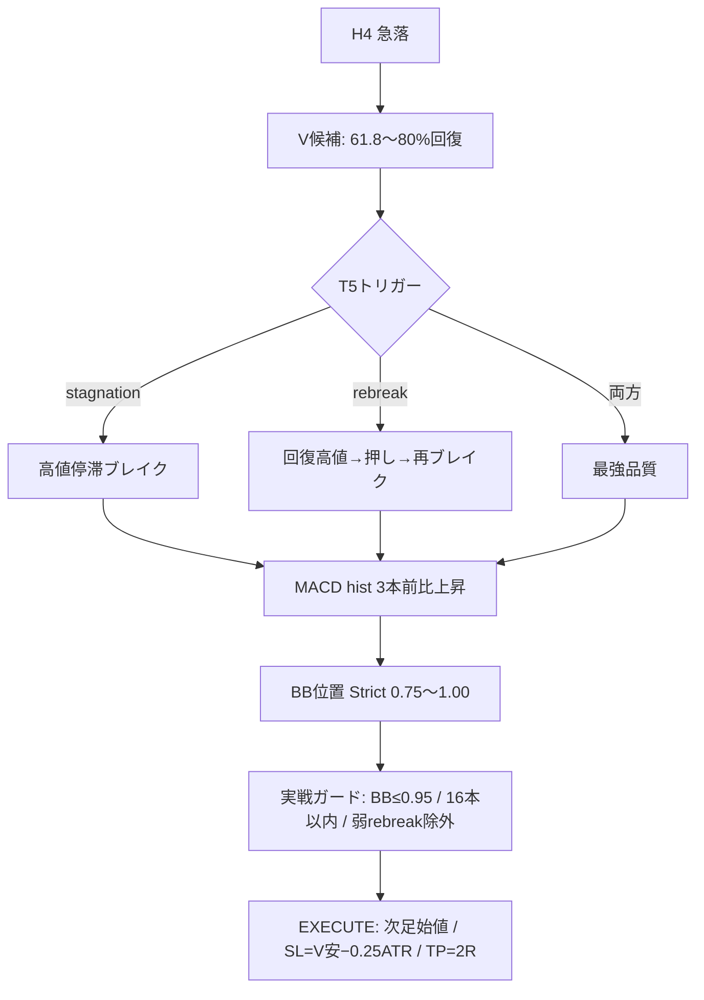

# H4 T5 手法 — 徹底リサーチ統合版

作成日: 2026-06-01  
ステータス: **本番第2柱（条件付き）** — Pine live-ready、フォワード30件待ち

> 関連: [h4_t5_macd_bb_practical_audit_2026-05-24.md](../h4_t5_macd_bb_practical_audit_2026-05-24.md) / [STRATEGY_GUIDE.md](../../STRATEGY_GUIDE.md) / [ultimate_method_v1_2026-06-01.md](./ultimate_method_v1_2026-06-01.md)

---

## 0. 一言定義

**T5 = 急落後V字回復を「環境」として使い、高値停滞（stagnation）または押し戻り後の再ブレイク（rebreak）で入る H4 ロング手法。**

V字そのものでは入らない。MACD + BB で再加速を確認してから入る。

---

## 1. T5 という名前の由来

`v_recovery_relaxation_ladder`（2015–2024）で、V字候補後のトリガーを段階的に緩和した結果:

| Stage | トリガー | trades | total_r | PF |
|---|---|---:|---:|---:|
| T4 | rebreak のみ | 253 | +45.66R | 1.36 |
| **T5** | **stagnation OR rebreak** | **294** | **+49.05R** | **1.33** |

T5 は stagnation パスを追加した段階。**その後 MACD/BB レイヤーを重ねたのが現行本番仕様。**

---

## 2. ロジックの3層構造

### Layer 1 — V候補（環境認識）

| 条件 | 値 |
|---|---|
| 急落 | pivot High→Low、幅 ≥ **3.5 ATR**、速度 ≥ **0.30 ATR/本** |
| 回復幅 | 下落幅の **61.8〜80%**（即100%回復は候補外） |
| 回復速度 | `回復本数 / 下落本数 ≤ max_recovery_to_drop` → 採用 **1.20**（REC1.2） |
| 最大待機 | V候補後 **24 H4本** 以内にトリガー |

### Layer 2 — T5トリガー（本当の入口）

| trigger_type | 意味 | 研究上の質 |
|---|---|---|
| **stagnation** | 回復ゾーンで高値が密集 → レンジ上抜け | 勝率高め |
| **rebreak** | 回復高値 → 押し → 再ブレイク | 件数多め |
| **stagnation+rebreak** | 両方成立 | **最強**（practical: 8t / 75%WR / PF5.38） |

### Layer 3 — MACD + BB（再加速確認）

| プリセット | BB位置 | BB幅 | MACD |
|---|---|---|---|
| Current | 0.60–1.10 | なし | slope3 > 0 |
| Robust | 0.75–1.05 | ≤ 7 ATR | slope3 > 0 |
| **Strict（本番）** | **0.75–1.00** | **≤ 7 ATR** | **slope3 > 0** |

### Layer 4 — 実戦ガード（Practical C125）

アンサンブル・live 運用で追加:

- `bb_pos ≤ 0.95`
- V候補 → シグナル ≤ **16 H4本**
- 弱い単独 rebreak 除外: `rebreak` かつ (`bb_pos > 0.95` OR `macd_hist_slope3 ≤ 0.03`)

### 出口（バックテスト/Pine デフォルト）

- エントリー: シグナル足 **次足始値**
- SL: V字安値 − **0.25 ATR**
- TP: **2R** 固定
- 最大保有: **180 H4本**（30日）
- R: スプレッド/スリッページ込み

---

## 3. 研究の進化史（何を試して何を捨てたか）

### Phase A — Immediate V（即エントリー）→ 却下

| Stage | 内容 | 結果 | 判定 |
|---|---|---|---|
| I0 厳格 | 100%回復+実体60% | −7.16R / PF0.72 | ❌ |
| I4 61.8%回復 | V字地点で即入 | +22.37R / PF1.19 | 弱い |
| I5 急落緩和 | 448t / +76R / PF1.29 | 件数は多いが質低 | **Vは環境のみ** |

**結論:** V字を見た瞬間に入ると850件研究の「V字飛び乗り」と同型。T5トリガー待ちが必須。

### Phase B — Trigger Ladder（T0→T5）→ T5採用

| Stage | 内容 | trades | total_r | PF |
|---|---|---:|---:|---:|
| T0–T3 | overlap only（停滞+再ブレイク重なりのみ） | 11–42 | +5.7〜+16.6R | 1.9–2.5 |
| T4 | rebreak only | 253 | +45.66R | 1.36 |
| **T5** | **stag OR rebreak** | **294** | **+49.05R** | **1.33** |

**結論:** stagnation パス追加で +3.4R。件数と質のバランスが最良。

### Phase C — MACD + BB レイヤー → Strict 採用

`run_t5_macd_bb_vshape_validation.py`（2015–2024, REC1.5）:

| プリセット | trades | total_r | PF | max_dd_r |
|---|---:|---:|---:|---:|
| Current 0.60–1.10 | 157 | +53.77R | 1.71 | 11.89R |
| Robust 0.75–1.05 | 129 | +63.07R | 2.13 | 8.78R |
| **Strict 0.75–1.00** | **102** | **+57.46R** | **2.41** | **5.74R** |

**結論:** Strict が PF/DD の最良トレードオフ。Current は DD 11.89R で本番向きでない。

### Phase D — 回復速度 REC スイープ → REC1.20 採用

`run_t5_recovery_ratio_sweep.py`:

| max_recovery_to_drop | IS trades | IS total_r | IS PF | OOS trades | OOS total_r | OOS PF |
|---|---:|---:|---:|---:|---:|---:|
| 0.80 | 74 | +53.26R | 2.96 | 11 | +3.81R | 1.75 |
| **1.20** | **99** | **+59.76R** | **2.55** | **15** | **+7.26R** | **2.44** |
| 1.50 | 102 | +57.46R | 2.41 | 16 | +7.11R | 2.37 |

**結論:** REC1.20 が IS+OOS 複合スコア最高。Pine プリセット `Balanced REC1.2`。

### Phase E — Failure Filter → Practical C125

`filter_summary.csv`（Strict REC1.20 ベース）:

| ルール | ALL trades | total_r | PF |
|---|---:|---:|---:|
| BASE | 114 | +67.03R | 2.54 |
| F1 BB≤0.95 | 67 | +48.58R | 3.12 |
| F2 recovery≤16 | 76 | +62.13R | 3.44 |
| F4 BB幅≤4 | 48 | +42.86R | 3.91 |
| F5 skip weak rebreak | 69 | +47.24R | 3.01 |
| **C125（実戦採用）** | **39** | **+35.90R** | **4.14** |
| C12345_all（全ガード） | 17 | +22.56R | 12.09 |

**結論:** ガードを全部 ON にすると PF は爆上がりするが **17件/10年** で実用不可。C125 が件数と PF のバランス点。

### Phase F — 却下・保留

| 方向 | 結果 | 判定 |
|---|---|---|
| **Short mirror T5** | broad −37.5R / PF0.68 | ❌ 却下 |
| **Short HV continuation** | IS 断片 +7R、OOS 0件 | 研究保留 |
| **SPX500 T5** | Pine default −1.92R | ❌ 却下 |
| **NAS100 T5** | broad +18R、OOS −0.3R | 監視のみ |
| **Immediate V at scale** | PF ~1.2–1.3 | ❌ エンジンにしない |
| **Trailing exit** | swing trail −1.46R | ❌ 固定2R維持 |
| **C12345 全ガード live** | 17t/10年 | ⏳ 監視ティアのみ |

---

## 4. 数値サマリー（確定版）

### 4.1 研究期間 IS（2015–2024）

| 設定 | trades | win_rate | total_r | PF | max_dd_r |
|---|---:|---:|---:|---:|---:|
| T5 base（MACD/BBなし） | 294 | 45.6% | +49.05R | 1.33 | 12.04R |
| Strict REC1.5 + MACD/BB | 102 | 53.9% | +57.46R | 2.41 | 5.74R |
| **Strict REC1.2 + MACD/BB** | **99** | **55.6%** | **+59.76R** | **2.55** | **6.67R** |
| Full strict practical（C125+幅≤4） | 23 | 69.6% | +22.35R | 4.59 | 2.15R |

### 4.2 OOS（2025–2026、データ〜2026-05-22）

| 設定 | trades | win_rate | total_r | PF | max_dd_r |
|---|---:|---:|---:|---:|---:|
| Strict REC1.2 | 15 | 66.7% | +7.26R | 2.44 | 2.02R |
| Full strict practical | 4 | 100% | +4.72R | inf | 0.0R |
| C125 | 5 | 100% | +6.71R | inf | 0.0R |

**注意:** OOS 15件は「有望」止まり。「完成」とは言えない。

### 4.3 アンサンブル（TB+T5、6通貨・AUDJPY除外）

| scenario | trades | total_r | PF | max_dd_r |
|---|---:|---:|---:|---:|
| TB only | 381 | +194.6R | 1.79 | 11.94R |
| T5 practical only | 30 | +25.3R | 3.43 | 4.35R |
| **all_trades** | **411** | **+219.9R** | **1.86** | **11.94R** |
| TB優先+T5空き時 | 399 | +206.4R | 1.82 | 11.94R |

---

## 5. 通貨別プロファイル（Strict REC1.5, 2015–2024）

| 通貨 | trades | total_r | PF | live推奨 |
|---|---:|---:|---:|---|
| **USDJPY** | 24 | +16.2R | 2.89 | ✅ 優先 |
| **GBPJPY** | 26 | +12.9R | 2.16 | ⚠️ IS強/OOS弱 |
| **XAUUSD** | 21 | +11.2R | 2.41 | ✅ 優先 |
| AUDJPY | 21 | +7.5R | 1.74 | ❌ OOS弱・TBも赤字 |
| CHFJPY | 17 | +4.5R | 1.50 | ✅ OOS良好 |
| EURJPY | 25 | +4.0R | 1.30 | ⚠️ 最弱級 |
| SILVER | 23 | +0.8R | 1.06 | ⚠️ 長期マージナル |

**初期 live 優先:** USDJPY / CHFJPY / XAUUSD  
**監視付き:** GBPJPY / SILVER  
**除外:** AUDJPY

---

## 6. トリガー別品質（Practical フィルタ後）

| trigger_type | trades | win_rate | total_r | PF |
|---|---:|---:|---:|---:|
| stagnation | 10 | 70% | +10.84R | 4.53 |
| rebreak | 16 | 50% | +9.53R | 2.50 |
| **stagnation+rebreak** | **8** | **75%** | **+8.82R** | **5.38** |

**読み取り:** 両方成立が最高品質。単独 rebreak は MACD/BB ガード必須。

---

## 7. 負け方の解剖（operational hardening）

損失の **61%** が以下2パターン:

1. **BB幅 > 4 ATR** — ボラ拡大後の過熱買い
2. **単独 rebreak（停滞なし）** — 850件 P01「抜け直後飛び乗り」に近い

対策（本番 Pine 実装済み）:

| ガード | 効果 |
|---|---|
| BB幅 ≤ 4 ATR → FULL / 4–5 → HALF / >5 → SKIP | DD 5.45R → 2.15R |
| MACD slope3 > 0.02 必須 | PF 4.59 → 6.53（20t） |
| 弱 rebreak 除外 | 騙し回避 |

---

## 8. 出口研究

| 出口 | total_r（strict 23t） | 判定 |
|---|---:|---|
| **fixed 2R（現行）** | **+22.36R** | ✅ 採用 |
| fixed 1.5R | +16.29R | 利確早すぎ |
| fixed 3R | +20.08R | 到達率低 |
| be_after_2r → 3R | +20.52R | 候補（v1.1） |
| partial 1R half rest 3R | +16.55R | 候補（v1.1） |
| swing trail 5 | **−1.46R** | ❌ |
| bb_mid_reversal | +1.84R | ❌ |

**結論:** v1.0 は固定 2R。BE/分割利確は v1.1 研究候補。

---

## 9. TrendBreak との関係

- T5 の **34件中14件** が同一通貨で TB と時間重複
- 同じ相場を二重に取りに行くリスク
- **運用ルール:** TB 優先、同一通貨空き時のみ T5 / 同方向2エンジンはロット半減
- アンサンブル `all_trades` (+219.9R) は重複排除なしの上限値

---

## 10. VIS / SQZ との位置づけ

| 手法 | 入口の違い | IS | ステータス |
|---|---|---:|---|
| **T5** | V候補 → MACD/BB再加速 → stag/rebreak | +59.76R / 99t | **本番第2柱** |
| **VIS** | V後 PRECALM → 6本棚ブレイク | +15.5R / 34t | 準本番#2 |
| **SQZ** | 急落 → 売り踏み上げ棚 | +24.7R / 43t | 準本番#1 |

T5 と VIS は **同じV宇宙、別エンジン**。近いが独立 → 同足同方向は半減 or 片方。

---

## 11. 実装ファイル

| 種別 | パス |
|---|---|
| **本番 Pine** | `pine/production/h4_t5_macd_bb_live_ready.pine` |
| 研究 visual | `pine/visual/h4_t5_macd_bb_visual.pine` |
| エンジン実装 | `backtests/elliott_fibo/run_v_recovery_trigger_study.py` |
| アンサンブル | `backtests/ensemble/run_trendbreak_t5_practical_combo.py` |

### 検証スクリプト一覧（13本）

| スクリプト | 目的 |
|---|---|
| `run_t5_macd_bb_vshape_validation.py` | プリセット比較 |
| `run_t5_macd_bb_harsh_validation.py` | 厳格監査（train/test, bootstrap, cost stress） |
| `run_t5_recovery_ratio_sweep.py` | REC1.0–2.0 スイープ |
| `run_t5_indicator_robust_search.py` | MACD/BB 安定領域グリッド |
| `run_t5_skeptic_audit.py` | 懐疑的監査（重複・コスト・1ポジ制限） |
| `run_t5_practical_robustness_audit.py` | LOO条件寄与・構造分析 |
| `run_t5_operational_hardening.py` | 出口・環境・TB相関 |
| `run_t5_oos_2025_validation.py` | 凍結ルール OOS |
| `run_t5_oos_2025_2026_vshape_validation.py` | REC1.0 vs 1.5 OOS |
| `run_t5_nas100_validation.py` | 指数転用 |
| `run_t5_short_mirror_validation.py` | ショート鏡像（却下） |
| `run_t5_short_high_vol_continuation.py` | ショートHV（保留） |
| `run_t5_short_practical_hardening.py` | ショート出口 |

**欠落:** `run_t5_failure_filter_validation.py`（CSVのみ存在）

---

## 12. 研究ギャップ（次に深めるべきこと）

| # | テーマ | 現状 | 次アクション |
|---|---|---|---|
| 1 | **Pine parity** | ✅ 期待値99件エクスポート済み | TV で USDJPY→全通貨照合 |
| 2 | **フォワード log** | 0件（live未開始） | 0.25R × 30件記録 |
| 3 | **T5×VIS 同時発火** | 専用 study なし | 重複率・合成P&L |
| 4 | **failure filter 再生成** | スクリプト欠落 | スクリプト復元 or 手順文書化 |
| 5 | **GBPJPY OOS 劣化** | IS +12.9R → OOS −3.48R | 通貨別ガード検討 |
| 6 | **2015–2016 弱さ** | Current preset で −2.22R | レジーム分析 |
| 7 | **出口 v1.1** | BE/partial 有望 | Pine 試験実装 |
| 8 | **ショート** | mirror 却下 | 別ロジック必要 |
| 9 | **2026 H2 データ** | 未更新 | データ追加後 OOS 更新 |
| 10 | **F1 節目ゲート** | TB のみ手動 | T5 Pine へ移植 |

---

## 13. 本番運用チェックリスト

- [ ] H4 確定足のみ（リペイントなし）
- [ ] プリセット: Strict 0.75–1.00 + REC1.2 + 騙し回避 ON
- [ ] ガード: BB≤0.95 / 16本以内 / 弱rebreak除外
- [ ] ロット: 最初 **0.25R**、30件後 0.5R → 1R
- [ ] 通貨: USDJPY / CHFJPY / XAUUSD 優先、AUDJPY 除外
- [ ] TB 重複時: 同一通貨空き時のみ T5
- [ ] visual Pine で実弾しない
- [ ] 約定差・スプレッド拡大を30件記録

---

## 14. 結論

T5 は **3段階の「待つ」** で成立する手法:

1. **V字を待つ**（61.8–80% 回復まで）
2. **停滞/再ブレイクを待つ**（T5トリガー）
3. **MACD/BB で再加速を待つ**（Strict + 実戦ガード）

850件失敗研究・Immediate V 却下・VIS/SQZ との棲み分けがすべて同じ結論を指す:

> **形（V・抜け）= STOP。利益 = WAIT → CHECK → EXECUTE。**

数値上は Strict REC1.2（99t / +59.76R / PF2.55）が研究の芯。  
live では Practical C125（23t / PF4.59）で DD を抑え、TB アンサンブル（+219.9R）で主力と合成する。

**次の研究優先度:** ~~Pine parity 期待値エクスポート~~ → **TV 照合実行** → フォワード30件 → T5×VIS 重複 → 出口 v1.1

### Pine parity 成果物（2026-06-01）

- スクリプト: `backtests/elliott_fibo/run_t5_pine_parity_export.py`
- 出力: `backtests/elliott_fibo/results_2026_06_01/t5_pine_parity/`
- Phase A: `python_expected_base_research_99.csv`（guards OFF で 99件照合）
- Phase B: `python_expected_practical_research_34.csv`（guards ON = live デフォルト）
