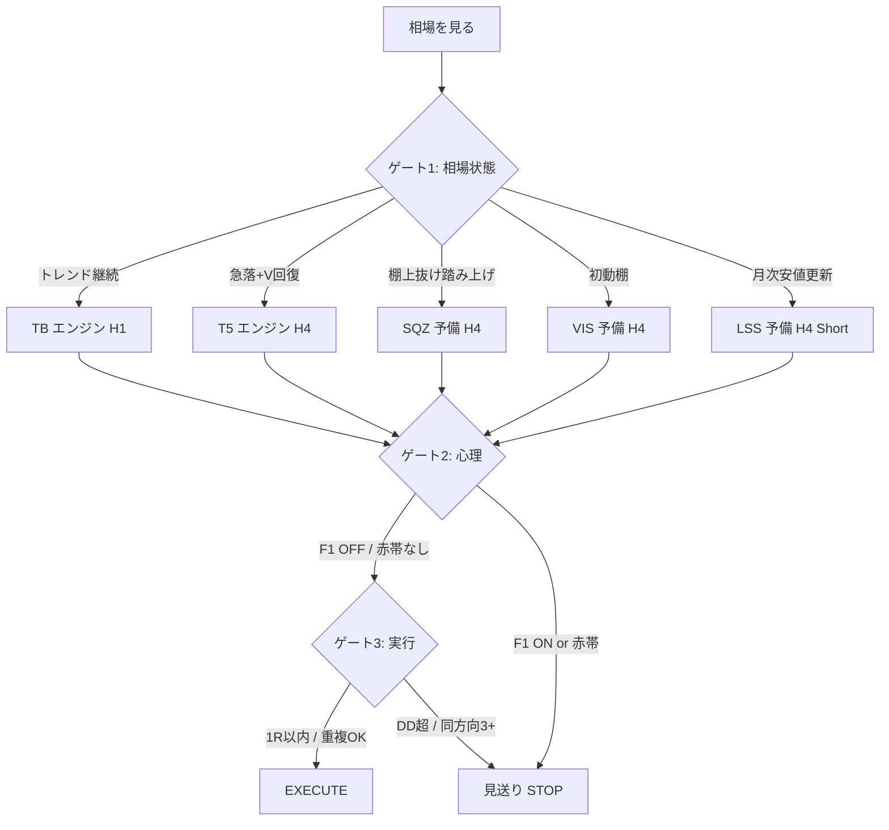

# FX-AI 究極手法 v1.0 — 研究統合版

作成日: 2026-06-01

> **一言:** 伸びる相場を H1 で取り、急落回復を H4 で厳選し、受講生850件が証明した「飛び乗り」をゲートで止める。  
> 新しいインジケータを増やすのではなく、**検証済みエンジン + 心理ゲート + 実行ルール** を1本に束ねる。

---

## 究極の結論（全研究の共通項）

850件テキスト・380件座標・10年バックテストが別々に言っていることは同じです。

| 研究 | 結論 |
|---|---|
| 850件失敗理由 | 根拠不足 + 節目飛び乗り + 損切遅れが連鎖 |
| 受講生つまずき | 同じ日時×価格で全員負け = 群衆の反応点 |
| TrendBreak + T5 | 2エンジン併用で +219.9R / PF1.86（6通貨10年） |
| F1試験 | 節目追い抑制で DD・損失額改善 |
| V/Squeeze/Shelf | **Vや抜けそのものではなく、待った後の確認で入る** |

**究極手法の核心:**

```text
EXECUTE（実行）= エンジンシグナル × ゲート通過 × リスク枠内
```

形（ブレイク・V字・棚）は **STOP（観察開始）**。  
利益は **WAIT → CHECK → EXECUTE** の順番を守ったときだけ出る。

---

## アーキテクチャ — 三重ゲート



### ゲート1 — 相場状態（どのエンジンか）

| 状態 | 見る目安 | エンジン | TF | 検証根拠 |
|---|---|---|---|---|
| **A. トレンド継続** | 高安値更新・節目突破後も方向維持 | **TrendBreakV1** | H1 | +194.6R / PF1.79 |
| **B. 急落→V→停滞** | 急落3.5ATR+ → 61.8〜80%回復 → MACD/BB一致 | **H4 T5実戦用** | H4 | +25.3R / PF3.43 |
| **C. 売り踏み上げ棚** | 急落→6本棚→上抜け（GBPJPY除外） | SQZ（予備） | H4 | +24.7R / PF2.21 |
| **D. 初動再点火棚** | V後PRECALM→6本棚ブレイク | VIS（予備） | H4 | +15.6R / PF2.09 |
| **E. 月次安値崩れ** | 120本安値更新→停滞下抜け | LSS（予備） | H4 Short | core4 +15.7R |

**ルール:** 1つの足で複数エンジンが点灯 → **優先順 TB > T5 > SQZ/VIS > LSS**。同方向2エンジンは **ロット半減 or 片方**.

### ゲート2 — 心理（入ってはいけない場所）

受講生研究を **売買フィルタ** に変換した層。

| ID | 名称 | 条件 | 根拠 |
|---|---|---|---|
| **F1** | 節目追い禁止 | ラウンド±N かつ 高値/安値帯 かつ 同方向足 | 380件・GBPJPY199/ XAU天井 |
| **STOP** | 群衆密集 | つまずきPine **赤帯**内 | 全敗18クラスタ |
| **WAIT** | 確認不足 | 抜け直後1〜4本 / レンジ中央 / ローソク1本のみ | 850件 P01/P02/P04 |
| **SL未設定** | 撤退なし | エントリー前にSL価格が言えない | 850件 損切遅れ302件 |

**究極ルール:** エンジンが緑でも **F1 or 赤帯 or SL未設定 → 見送り**。  
逆張りではない。**同方向の早い入口を1テンポ遅らせる**。

### ゲート3 — 実行（いくら入るか）

| ルール | 内容 |
|---|---|
| 基本リスク | **1R = 口座1%**（TB） |
| T5 / 予備 | 最初 **0.25〜0.5R**、30件後に1R |
| 同時保有 | 最大 **6ポジション (=6%)** |
| 同方向相関 | JPYクロス+金銀で **同方向3以上 → 1件スキップ** |
| DD停止 | **-20% で全停止** |
| 連敗 | 11連敗想定内。13連敗でロット半減（任意） |
| 除外通貨 | **AUDJPY**（PF0.97） |

---

## エンジン詳細 — 本番2本柱

### 柱1: TrendBreakV1 HYBRID（主力）

| 項目 | 値 |
|---|---|
| Pine | [`pine/production/TrendBreakV1_Final.pine`](../../pine/production/TrendBreakV1_Final.pine) |
| TF | H1 |
| 通貨 | XAUUSD, USDJPY, EURJPY, GBPJPY, CHFJPY, SILVER |
| RR | 1:3 |
| SL | ATR×1.5 |
| 年間 | ~38 trades/通貨 |

**F1適用:** v2.x移植前は、GBPJPY/XAUUSD H1で **節目手前のTBシグナルを手動見送り**（199/195/2948等）。

### 柱2: H4 T5 + MACD + BB 実戦用（補助）

| 項目 | 値 |
|---|---|
| Pine | [`pine/production/h4_t5_macd_bb_live_ready.pine`](../../pine/production/h4_t5_macd_bb_live_ready.pine) |
| TF | H4 |
| プリセット | Strict 0.75-1.00 + REC1.2 + 騙し回避ON |
| RR | 1:2 |
| トリガー優先 | **stagnation+rebreak** > stagnation > rebreak |
| V候補だけ | **入らない**（16本以内の停滞/再ブレイク必須） |

---

## エンジン詳細 — 予備2本柱（昇格待ち）

| 代号 | 昇格条件 | 現状 |
|---|---|---|
| SQZ | Pine一致 + 0.25R×30件 PF≥1.5 | フォワード候補 |
| VIS | Python34件一致 + 0.25R×30件 | strategy版のみ |
| LSS | Pine parity修正 + 0.25R×30件 | **parity未解決** |
| DTS | 20件フォワード + VISとの統合 | 件数9・監視 |

詳細: [`near_main_validation_roadmap_2026-06-01.md`](near_main_validation_roadmap_2026-06-01.md)

---

## 通貨別 — 究極マトリクス

| 通貨 | TB | T5 | SQZ | VIS | LSS | 注意 |
|---|---|---|---|---|---|---|
| **XAUUSD** | ◎主力 | ◎ | ◎ | ×除外 | ◎core4 | 天井買いSTOP（2934/2777/2948） |
| **USDJPY** | ◎ | ◎ | ○ | ○ | △除外 | 140円割れ狙いSTOP |
| **GBPJPY** | ◎ | △OOS弱 | **×除外** | ○ | ◎core4 | 199/195追いSTOP。SQZ不採用 |
| **CHFJPY** | ○ | ◎ | ○ | ×除外 | ◎ | |
| **EURJPY** | ○ | △少 | ○ | ○ | ◎ | |
| **SILVER** | ◎ | △少 | ○ | ×除外 | △ | TB主役 |
| **AUDJPY** | **×** | △ | △ | ○ | × | 全体除外 |

---

## 1トレードの手順（実践フロー）

### Step 0 — アラートが来た

1. どのエンジンか特定（TB / T5 / 予備）
2. `pine/visual/` 由来のシグナル → **無視**（リペイント疑い）

### Step 1 — ゲート2（30秒）

- [ ] 節目±0.8円（GBPJPY）/ ±25ドル（XAU）の **追い足** ではないか → F1
- [ ] つまずきPine **赤帯**内ではないか → STOP
- [ ] 抜け直後1〜2本だけの **飛び乗り** ではないか → WAIT
- [ ] **SL価格** を数字で言えるか → 言えなければ見送り

### Step 2 — ゲート3（10秒）

- [ ] 口座DD < 20%
- [ ] 同時保有 < 6
- [ ] 同方向JPY+金銀 < 3
- [ ] 同通貨でTB/T5/予備が被っていないか → 被りなら優先順で片方

### Step 3 — EXECUTE

- TB: **1R**
- T5: **0.25〜0.5R**（30件未満）
- 予備: **0.25R**（昇格前）

### Step 4 — 記録

[`ultimate_method_daily_checklist.csv`](../trade_practice_records/ultimate_method_daily_checklist.csv)  
[`near_main_forward_validation_log.csv`](../trade_practice_records/near_main_forward_validation_log.csv)

---

## Pine 配置（12枚 + 教材2枚）

### 本番12枚（売買）

| # | 通貨 | TF | Pine |
|---:|---|---|---|
| 1-2 | XAUUSD | H1/H4 | TB + T5 |
| 3-4 | USDJPY | H1/H4 | TB + T5 |
| 5-6 | EURJPY | H1/H4 | TB + T5 |
| 7-8 | GBPJPY | H1/H4 | TB + T5 |
| 9-10 | CHFJPY | H1/H4 | TB + T5 |
| 11-12 | SILVER | H1/H4 | TB + T5 |

### 教材2枚（売買しない）

| 用途 | Pine |
|---|---|
| 群衆つまずき | `student_stumble_zones_*_v0_5.pine`（赤=STOP参考） |
| F1試験 | `stumble_chase_suppression_experiment_v0_1.pine` |

---

## やらないこと（究極の除外リスト）

| 除外 | 理由 |
|---|---|
| Sai H1 4手法混在 | PF1.05 |
| V字単独 / Capitulation直買い | 根拠不足 |
| Synapse / Elliott / VFIB | BACKTEST ❌ |
| psychology_text Pine | 850教材用 |
| visual系インジの実弾 | リペイント |
| 4エンジン同時フルロット | 重複リスク |
| パラメータ日次変更 | 過剰最適化 |

---

## 期待成績（検証ベース・参考）

6通貨・2015-2024・コスト込み・**両方フル運用**:

| 指標 | 値 |
|---|---|
| Trades | 411 |
| WR | 40.9% |
| PF | 1.86 |
| Total R | +219.9R |
| MaxDD | 11.9R |

**注意:** 究極手法 v1 はこの2本柱に **F1手動ゲート** を足した運用設計。F1の定量効果は v2.x移植後に再計測。

---

## v1 → v2 ロードマップ

| 段階 | 内容 | 状態 |
|---|---|---|
| v1.0 | 2本柱 + 三重ゲート + 手動F1 | **今ここ** |
| v1.1 | F1をTB Pineに自動AND | v2.x待ち |
| v1.2 | SQZ or VIS 昇格 → 第3柱 | フォワード中 |
| v1.3 | LSS 昇格 → ショート柱 | parity修正後 |
| v2.0 | 4柱 + 自動重複管理 | 全昇格後 |

---

## 関連ドキュメント

| テーマ | ファイル |
|---|---|
| 運用本体 | [STRATEGY_GUIDE.md](../../STRATEGY_GUIDE.md) |
| 2本柱公式 | [two_method_practical_research_2026-05-24.md](../two_method_practical_research_2026-05-24.md) |
| 全検証一覧 | [BACKTEST_INDEX.md](../BACKTEST_INDEX.md) |
| F1試験 | [stumble_chase_suppression_filter_v0_1.md](stumble_chase_suppression_filter_v0_1.md) |
| 850失敗理由 | [trade_psychology_failure_reason_research_2026-05-31.md](trade_psychology_failure_reason_research_2026-05-31.md) |
| 予備4候補 | [near_main_validation_roadmap_2026-06-01.md](near_main_validation_roadmap_2026-06-01.md) |
| 日次チェック | [ultimate_method_daily_checklist.csv](../trade_practice_records/ultimate_method_daily_checklist.csv) |
