# 市場心理図鑑（Market Psychology Atlas）

> ローソク足を研究するのではなく、**人間の意思決定**を研究するための辞書。

作成日: 2026-06-03  
関連: [pattern_library (旧10パターン)](../市場心理パターンライブラリ_2026-05-30.md) ／ [framework](../../skills/market_psychology/framework.md)

---

## この図鑑の目的

| やらないこと | やること |
|---|---|
| ダブルトップ、V字反転、レンジ等の形を分類する | その瞬間、参加者が何を考え、何を選んだかを分類する |
| パターン名で売買する | 心理 → 需給 → 検証可能条件へ翻訳する |
| 1本の巨大ストラテジーにまとめる | Event scanner → Trigger study → Strategy の4段階で検証する |

### 翻訳の流れ

```
チャート上の変化
    ↓
市場参加者の心理（頭の中の独白）
    ↓
意思決定（買う / 売る / 待つ / 降参する）
    ↓
需給の実態（誰の注文が価格を動かしたか）
    ↓
検証可能な条件（Python / Pine）
    ↓
期待される結果（MFE / MAE / 継続 or 反転）
```

---

## 巻一覧

| 巻 | ファイル | 内容 | パターン数 |
|---|---|---:|---:|
| **Vol.1** | [vol01_core_patterns.md](vol01_core_patterns.md) | 基本12パターン | 12 |
| **Gallery** | [gallery.md](gallery.md) | 示意ローソク足イラスト | 12 |
| **Real** | [real_gallery.md](real_gallery.md) | **実OHLC** 代表1枚×12 | 12 |
| **Collection** | [collection/index.md](collection/index.md) | **実OHLC** パターン大量収集 | 90+ |

再生成: [SETUP_REAL_CHARTS.md](SETUP_REAL_CHARTS.md) ／ [SETUP_COLLECTION.md](SETUP_COLLECTION.md)

---

## 感情カテゴリ（共通分類）

各パターンは、以下のいずれか（または複数）で分類する。

| カテゴリ | 意味 | 典型の独白 |
|---|---|---|
| **恐怖** | 損失・踏み外しへの不安 | «もう限界» «逃げなきゃ» |
| **期待** | 利益・方向への確信 | «まだ続く» «今入らないと» |
| **執着** | 現状維持への固執 | «まだ戻る» «認めたくない» |
| **回収欲求** | 損失を取り返したい | «あと少しで元が取れる» |
| **利益防衛** | 含み益を守りたい | «確実に取ろう» |
| **降伏** | 方向放棄・損切り | «もう無理» «降りる» |
| **希望** | 好転への期待 | «ここが底» «必ず戻る» |
| **後悔** | 過去の判断への悔しさ | «あの時入れば» «見送って正解…いや» |
| **迷い** | 方向判断不能 | «上も下も説明がつく» |
| **無関心** | 参加意欲の低下 | «動かない、見るのやめよう» |

---

## Vol.1 パターン早見表（ビジュアル）

| ID | 図 | パターン名 | 主感情 |
|---:|---|---|---|
| 01 | 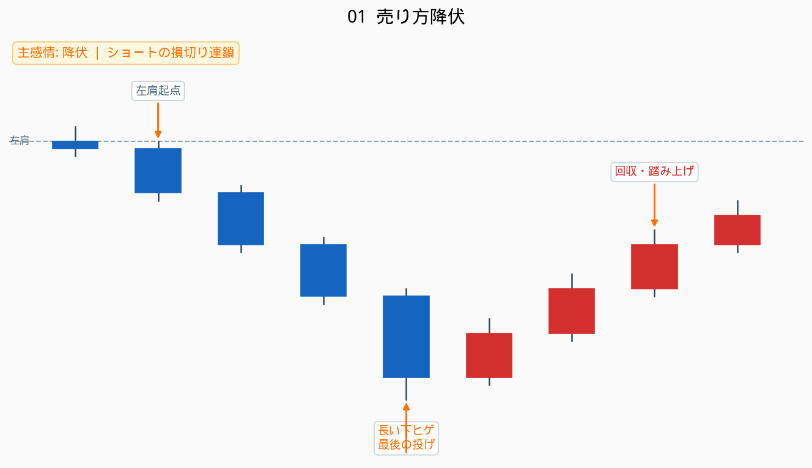 | [売り方降伏](vol01_core_patterns.md#01-売り方降伏) | 降伏 |
| 02 | 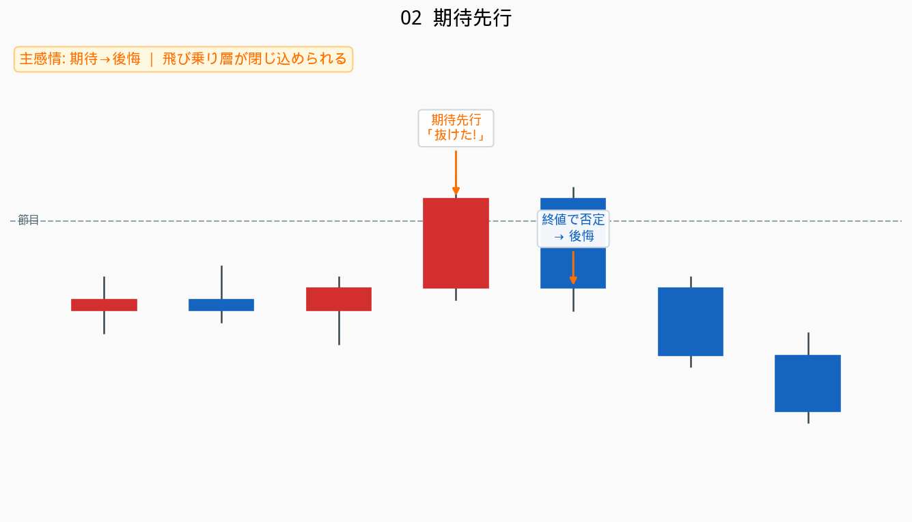 | [期待先行](vol01_core_patterns.md#02-期待先行) | 期待→後悔 |
| 03 | 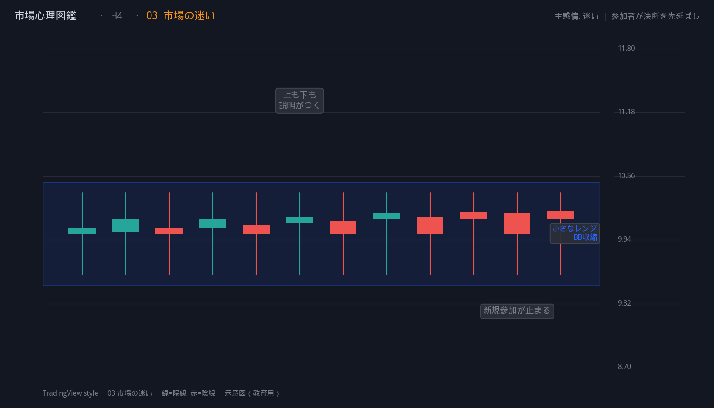 | [市場の迷い](vol01_core_patterns.md#03-市場の迷い) | 迷い |
| 04 | 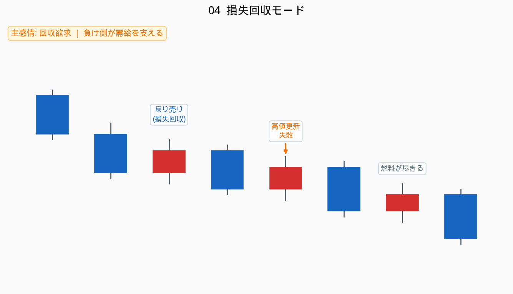 | [損失回収モード](vol01_core_patterns.md#04-損失回収モード) | 回収欲求 |
| 05 | 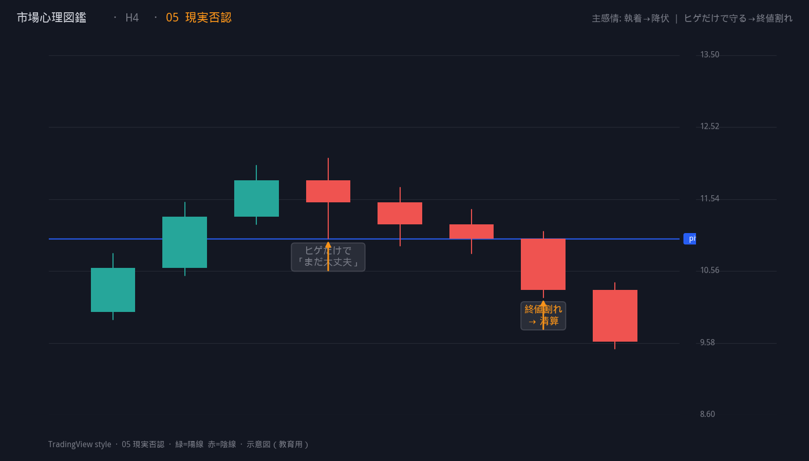 | [現実否認](vol01_core_patterns.md#05-現実否認) | 執着→降伏 |
| 06 | 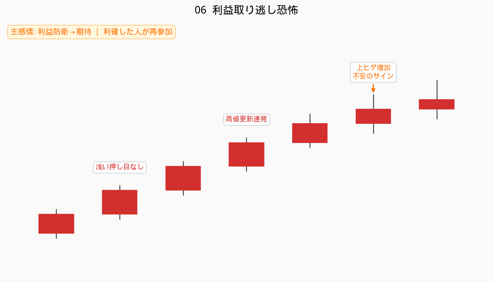 | [利益取り逃し恐怖](vol01_core_patterns.md#06-利益取り逃し恐怖) | 利益防衛→期待 |
| 07 | 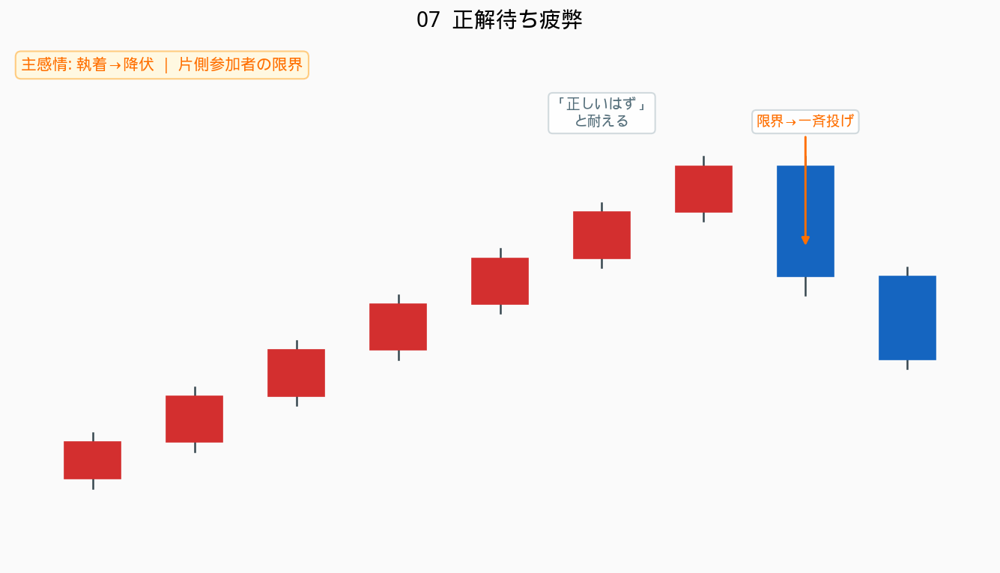 | [正解待ち疲弊](vol01_core_patterns.md#07-正解待ち疲弊) | 執着→降伏 |
| 08 | 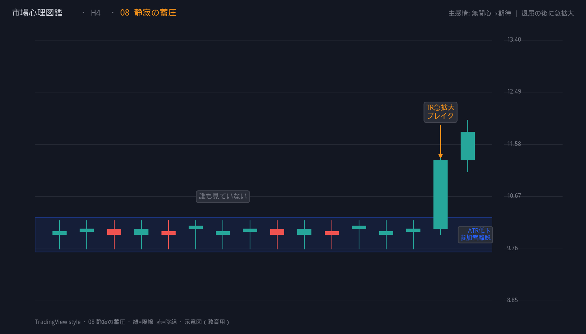 | [静寂の蓄圧](vol01_core_patterns.md#08-静寂の蓄圧) | 無関心→期待 |
| 09 |  | [最後の信念者](vol01_core_patterns.md#09-最後の信念者) | 希望→降伏 |
| 10 | 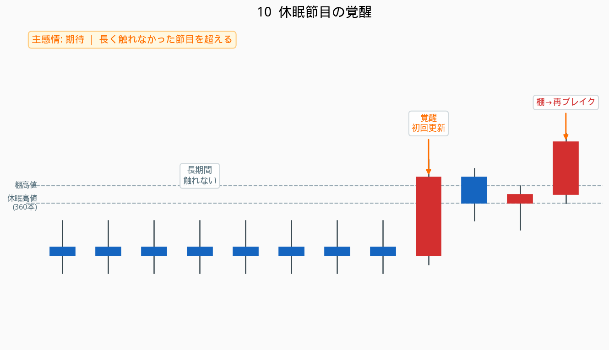 | [休眠節目の覚醒](vol01_core_patterns.md#10-休眠節目の覚醒) | 期待 |
| 11 | 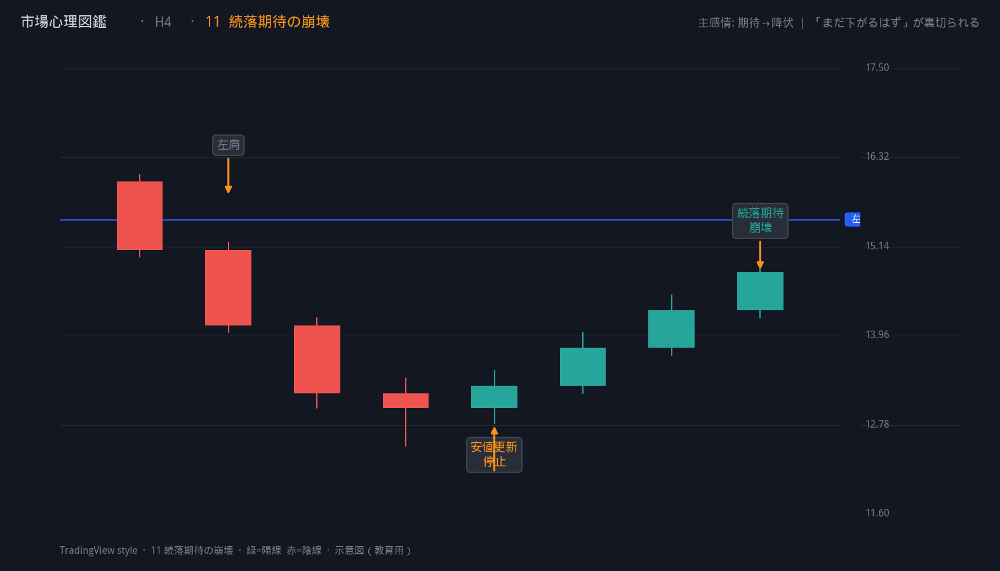 | [続落期待の崩壊](vol01_core_patterns.md#11-続落期待の崩壊) | 期待→降伏 |
| 12 | 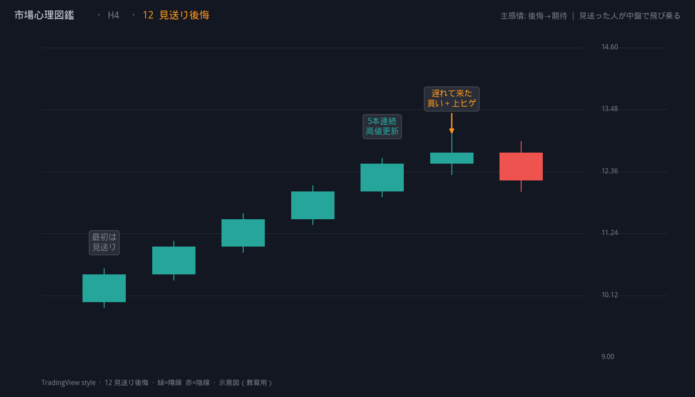 | [見送り後悔](vol01_core_patterns.md#12-見送り後悔) | 後悔→期待 |

> 画像の再生成: `python3 docs/research/市場心理図鑑/generate_charts.py`（TradingView ダークテーマ）

---

## Vol.1 パターン早見表（テキスト）

| ID | パターン名 | 主感情 | 方向 | 旧ライブラリ対応 |
|---:|---|---|---|---|
| 01 | [売り方降伏](vol01_core_patterns.md#01-売り方降伏) | 降伏 | Long | Short Squeeze |
| 02 | [期待先行](vol01_core_patterns.md#02-期待先行) | 期待 → 後悔 | Both | Trap |
| 03 | [市場の迷い](vol01_core_patterns.md#03-市場の迷い) | 迷い | Both | Compression |
| 04 | [損失回収モード](vol01_core_patterns.md#04-損失回収モード) | 回収欲求 | Both | （新規） |
| 05 | [現実否認](vol01_core_patterns.md#05-現実否認) | 執着 → 降伏 | Short | Long Liquidation 前段 |
| 06 | [利益取り逃し恐怖](vol01_core_patterns.md#06-利益取り逃し恐怖) | 利益防衛 → 期待 | Long | FOMO |
| 07 | [正解待ち疲弊](vol01_core_patterns.md#07-正解待ち疲弊) | 執着 → 降伏 | Both | Pain Trade |
| 08 | [静寂の蓄圧](vol01_core_patterns.md#08-静寂の蓄圧) | 無関心 → 期待 | Both | Compression → Expansion |
| 09 | [最後の信念者](vol01_core_patterns.md#09-最後の信念者) | 希望 → 降伏 | Long | Capitulation |
| 10 | [休眠節目の覚醒](vol01_core_patterns.md#10-休眠節目の覚醒) | 期待 | Both | Dormant Breakout |
| 11 | [続落期待の崩壊](vol01_core_patterns.md#11-続落期待の崩壊) | 期待 → 降伏 | Long | Expectation Failure |
| 12 | [見送り後悔](vol01_core_patterns.md#12-見送り後悔) | 後悔 → 期待 | Long | FOMO 後段 |

---

## 図鑑の使い方

### 1. Event scanner（イベント検出）

心理パターンに該当するバーを記録し、**エントリーはしない**。  
12 / 24 / 48 / 72 本後の MFE / MAE を測る。

### 2. Trigger study（Entry 契機の絞り込み）

イベント後の押し目、棚ブレイク、再ブレイクだけを検証する。

### 3. Strategy（売買ルール化）

期待値が残った合成のみルール化する。  
**文脈 AND Entry trigger** で初めて売買する。

### 4. Pine parity（時刻照合）

Python のイベント時刻と TradingView のラベル時刻を一致させる。

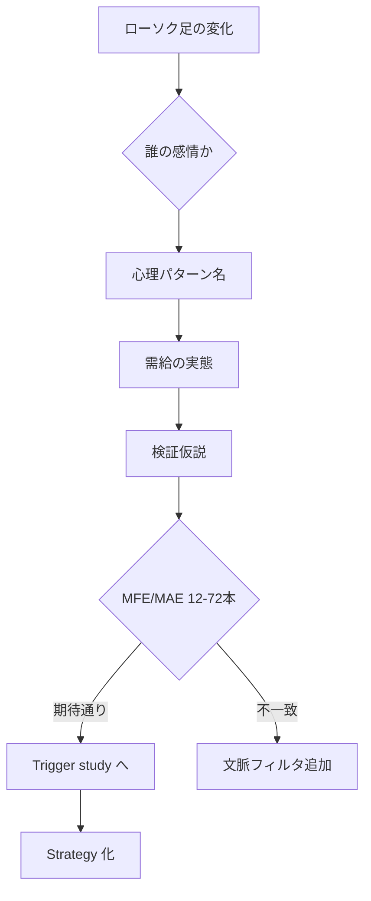

---

## 検証済みの合成（現時点）

Vol.1 のうち、バックテストで相性がよい合成:

**売り方降伏 + 続落期待の崩壊 + ボラ拡大**

1. 急落する
2. 活動量が増える
3. 急反発する
4. 左肩起点または直近高値を更新する
5. 押しても売りが続かない
6. 押し高値を再上抜ける
7. ボラが拡大する

→ `IGNITION_STRICT` / `SQZ_STRICT` として検証済み。  
詳細: [市場心理スクイーズ厳選_2026-05-30.md](../市場心理スクイーズ厳選_2026-05-30.md)

---

## アンチパターン（図鑑利用時の注意）

| # | やってはいけないこと | 理由 |
|---|---|---|
| AP1 | 期待先行を H4 単独で逆張り | Trap 単独は PF 0.92 以下 |
| AP2 | 最後の信念者で V 字単独買い | Capitulation 単独は PF 0.99 |
| AP3 | 売り方降伏を D1 売り否定直後に買う | PF / DD 悪化確認済み |
| AP4 | 形の名前（ダブルトップ等）で Entry する | 心理と需給が見えなくなる |

---

## 次の巻（予定）

| 巻 | テーマ | 内容 |
|---|---|---|
| Vol.2 | 心理合成 | D1 の現実否認 × H4 の売り方降伏 等、時間軸の重なり |
| Vol.3 | 通貨別心理 | GBPJPY=勢いの罠、XAUUSD=値幅の罠、USDJPY=節目の罠 |
| Vol.4 | 失敗心理 | 受講生つまずきクラスタとの対応表 |

---

## 各パターンの記載フォーマット

Vol.1 以降、すべて以下の項目で統一する。

1. **パターン名** — 人間の感情・行動を表す名前
2. **心理** — 市場参加者の頭の中の独白
3. **感情カテゴリ** — 上記10分類から
4. **感情の流れ** — 時系列での感情遷移
5. **ローソク足特徴** — 代理指標としてのチャート特徴
6. **実際に起きていること** — 需給の説明
7. **検証仮説** — Python / Pine で検証可能な条件
8. **期待される結果** — MFE/MAE、継続/反転/ダマシ等
9. **教訓** — トレーダーが学ぶべき内容を一文で
