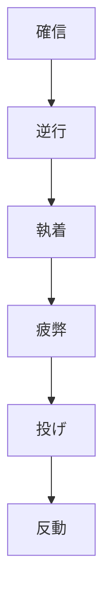

# ポジションを持っている人が投げ出す瞬間

> [← 図鑑トップ](README.md) ／ [Vol.1 基本12パターン](vol01_core_patterns.md)

作成日: 2026-06-03  
テーマ: **降伏** — 市場心理図鑑における「投げ」の解剖

---

## はじめに：投げは「形」ではない

チャート上でよく見る **Capitulation（キャピチュレーション）** や **Long Liquidation（ロング清算）** という言葉は、形の名前に聞こえがちです。

しかし本当に起きているのは、こういうことです。

> **まだ信じていた人が、もう信じられなくなった瞬間。**

ローソク足はその結果を記録しているだけで、原因は常に **頭の中の独白** にあります。

市場心理図鑑では、投げを次のように定義します。

| 定義 | 内容 |
|---|---|
| **投げ** | 含み損・含み益・分析・希望を手放し、**反対方向の注文**を出す瞬間 |
| **降伏** | 「自分は正しい」という主張をやめ、**現実に合わせて動く**こと |
| **需給上の意味** | 新規の確信ではなく、**既存ポジションの解消**が価格を動かす |

投げは「安いから買う」「高いから売る」ではありません。  
**もう持っていられないから、売る（または買い戻す）。**

---

## 投げは3種類ある

同じ「投げ」でも、**誰が・なぜ・どの方向に**投げるかで需給はまったく違います。

### 1. ロングの投げ（現実否認 → 清算）

**典型:** [05 現実否認](vol01_core_patterns.md#05-現実否認) → [07 正解待ち疲弊](vol01_core_patterns.md#07-正解待ち疲弊)

**独白の変化:**

```
«一時的な調整だ»          ← 否認
«まだ戻る»                ← 執着
«もう限界…降りる»         ← 投げ
```

**需給:** ロング保有者の**売り**が一方向に集中。ファンダメンタルより先に、**ポジションの物理**が価格を押し下げる。

**チャート上のサイン（代理指標）:**

- 重要節目をヒゲだけで何度も守る → 終値で割れる
- 割れたあと、戻り売りではなく**成行の売り**で加速
- 活動量が増えるが、安値更新が止まらない

---

### 2. ショートの投げ（売り方降伏）

**典型:** [01 売り方降伏](vol01_core_patterns.md#01-売り方降伏) ／ [11 続落期待の崩壊](vol01_core_patterns.md#11-続落期待の崩壊)

**独白の変化:**

```
«まだ下がる»              ← 期待
«下がらない…困る»         ← 執着
«もう無理、買い戻す»       ← 投げ（ショートカバー）
```

**需給:** 新規ロングの確信買いより、**ショートの損切り買い**が先に価格を押し上げる。  
だから反転の第一声は「底が来た」ではなく **「売り方が降参した」** なのです。

**チャート上のサイン:**

- 急落後、追加下落せず**棚**を形成
- 棚高値を**終値**で上抜け
- 右肩（回復）の速度 ≥ 左肩（下落）の速度

> 検証済み合成: 売り方降伏 + 続落期待の崩壊 + ボラ拡大  
> 詳細: [market_psychology_squeeze_strict_2026-05-30.md](../market_psychology_squeeze_strict_2026-05-30.md)

---

### 3. 最後の信念者の投げ（心理底）

**典型:** [09 最後の信念者](vol01_core_patterns.md#09-最後の信念者)

**独白:**

```
«ここが歴史的な底だ»       ← 希望
«まだ早い人がいる»         ← 先回り
«信じていた自分がバカだった» ← 投げ
```

**需給:** 「底だ」と信じた層が**最後まで残り、そこで一斉に売る**。  
ファンダメンタル底ではなく **心理底** — **もう売る人がいなくなったあと**に、初めて本当の反転が始まりやすい。

**チャート上のサイン:**

- 長期下落後、2〜3回の底値テスト
- 最終足: 長い下ヒゲ + 活動量最大（ATR×2.5超）
- 次足で前足高値を終値更新

**注意:** V字単独買いは弱い（図鑑 AP2）。投げの**確認後**に入る。

---

## 投げの前に必ず来る「4段階」

どのパターンでも、投げの直前にはほぼ同じ感情の順序があります。



| 段階 | 参加者の状態 | 市場への影響 |
|---|---|---|
| **確信** | 「分析は合っている」 | 逆方向のポジションが積み上がる |
| **逆行** | 「一時的だ」 | まだ需絑は拮抗。価格は停滞しがち |
| **執着** | 「損切りはまだ早い」 | [04 損失回収モード](vol01_core_patterns.md#04-損失回収モード) — 反発は燃料が弱い |
| **疲弊** | 時間と資金が尽きる | [07 正解待ち疲弊](vol01_core_patterns.md#07-正解待ち疲弊) — 限界資金が動く |
| **投げ** | 「もう無理」 | 一方向への注文集中。ボラ拡大 |
| **反動** | 投げた側の安堵 + 逆方向の新規 | 過剰反応 → しばしば[02 期待先行](vol01_core_patterns.md#02-期待先行)の罠 |

**疲弊と投げの境目**が、トレーダーが最も見落とすポイントです。  
チャートでは「まだトレンドが続いているように見える」のに、**参加者の心理はすでに限界**に達していることがあります。

---

## 投げの瞬間、誰の注文が価格を動かすか

| 投げの種類 | 動く注文 | 価格への効果 | 新規参入の質 |
|---|---|---|---|
| ロング清算 | 成行売り | 下落加速 | まだ「底」確信ではない |
| ショートカバー | 成行買い | 上昇加速 | まだ「天井」確信ではない |
| 最後の信念者 | 損切り売り | 心理底形成 | 反転候補（要確認） |
| 利益確定の投げ | 利確売り/買い | 一時調整 | [06 利益取り逃し恐怖](vol01_core_patterns.md#06-利益取り逃し恐怖) 前段 |

共通ルール:

> **投げ直後の動きは「反転の確信」ではなく「投げた側の安堵」で動いている。**

だから、投げ足1本目で逆張りするより、**投げ後の棚・再ブレイク・文脈の一致**を待つ方が、図鑑の検証結果と整合します。

---

## 投げと「ただの反発」の見分け方

| 見るべきこと | 投げに近い | ただの反発 |
|---|---|---|
| **反発の原因** | 既存ポジションの解消 | 新規の確信エントリー |
| **活動量** | 急増（ATR×2以上） | 平均的 |
| **前の文脈** | 15〜30本以上の一方向偏り | レンジ内 |
| **終値の位置** | 反対方向に明確な実体 | ヒゲだけ、実体小 |
| **その後** | 棚形成 → 再ブレイク | すぐ元の方向へ回帰 |

**04 損失回収モード** の反発は「投げの前触れ」に見えて、**まだ投げではない** ことが多い。  
燃料が尽きたあとの **07 正解待ち疲弊** こそ、本番の投げに近い。

---

## ケーススタディ：USDJPY H4（2026年5月）

介入後の急落 → V字回復は、図鑑の言葉で読むとこうなります。

| 時期 | 出来事 | 図鑑パターン | 心理 |
|---|---|---|---|
| 5月初旬 | 160超 → 155付近へ垂直落下 | 01 売り方降伏（初動） | ロング投げ + ショートの一時的勝利 |
| 5月中旬 | 155付近から急反発 | 01 + 11 合成 | **ショートの投げ**（買い戻し連鎖） |
| 5月下旬 | 158〜157で揉み合い | 03 市場の迷い | 方向未確定。WAIT |
| 6月初旬 | 159〜160へ回復 | 06 利益取り逃し恐怖 前段 | 利確と再参加が混在 |

**いま（6月初旬）の位置づけ:**

- 5月の **ショート投げ** フェーズは**終了**
- 160前後は **06**（利確）と **02**（節目ダマシ）の境界
- **162** 付近は新しい「期待先行」リスクゾーン

> 投げは「過去に一度起きた」だけで終わらない。  
> **次の投げは、今160付近にいるロングの利確か、162で入ったショートの投げか** — どちらの限界資金が先に動くか、という問いになる。

---

## 投げの瞬間を記録する方法

記事を書く・研究するなら、形ではなく **独白と決断** を残すのが有効です。

### 記録テンプレート

| 項目 | 記入例 |
|---|---|
| **日時・通貨・時間足** | 2026-05-06 USDJPY H4 |
| **誰が投げたか** | ショート / ロング / 両方 |
| **投げる直前の独白** | «下がらない、もう無理» |
| **投げのトリガー** | 棚上抜け / 節目割れ / 時間経過 |
| **チャート代理指標** | ATR×2.8、終値が棚上 |
| **図鑑パターンID** | 01, 07, 09 等 |
| **投げ後24〜72本の結果** | MFE / MAE |

CSV テンプレ: [realtime_trade_psychology_log_template.csv](../realtime_trade_psychology_log_template.csv)

---

## 実践的な教訓（売買ルールではなく、観察ルール）

1. **投げは「安い/高い」から起きない。** 「持てない」から起きる。
2. **投げ直後は逆張りより確認。** 第一声は降伏であり、確信ではない。
3. **疲弊を形で測るな。** 一方向偏り + 限界資金の動き（活動量・速度）を見る。
4. **誰が今入っているかを常に問う。** 06・12 の参加者が厚いとき、次の投げは近い。
5. **時間足を混ぜる。** D1 の現実否認 × H4 の売り方降伏 — Vol.2 予定の合成研究。

---

## 図鑑との対応表

| 投げの文脈 | Vol.1 パターン | 主感情 |
|---|---|---|
| 上昇トレンド保有者の投げ | 05 現実否認 → 07 正解待ち疲弊 | 執着 → 降伏 |
| 下落期待ショートの投げ | 01 売り方降伏、11 続落期待の崩壊 | 期待 → 降伏 |
| 底信念ロングの投げ | 09 最後の信念者 | 希望 → 降伏 |
| 投げ前の「偽反発」 | 04 損失回収モード | 回収欲求 |
| 投げ後の罠 | 02 期待先行 | 期待 → 後悔 |

---

## 次に書けること（Vol.2 候補）

| テーマ | 内容 |
|---|---|
| **時間軸の投げ** | D1 で耐えた人が H4 で投げる / その逆 |
| **通貨別の投げ方** | USDJPY=節目、GBPJPY=勢い、XAU=値幅 |
| **投げの連鎖** | 1次投げ → 反動 → 2次投げ（ダブル投げ） |
| **Event scanner** | 投げ候補バーを記録し MFE/MAE を測る |

---

## まとめ

**ポジションを持っている人が投げ出す瞬間**とは、

> 分析・希望・プライドを手放し、  
> **反対方向の注文**で現実に合わせる瞬間

です。

ローソク足の長いヒゲや大陽線は、その瞬間の**結果**にすぎません。  
研究すべきは形ではなく、**その直前に何人が・どんな独白で・限界を迎えたか**です。

市場心理図鑑は、その瞬間に名前を与え、検証可能な条件へ翻訳するための辞書です。

---

> **関連:** [Vol.1 まとめ（フェーズ表）](vol01_core_patterns.md#vol1-まとめ) ／ [SQZ_STRICT 検証](../market_psychology_squeeze_strict_2026-05-30.md) ／ [H4 V字回復](../h4_v_recovery_strategy_candidates_2026-05-30.md)
