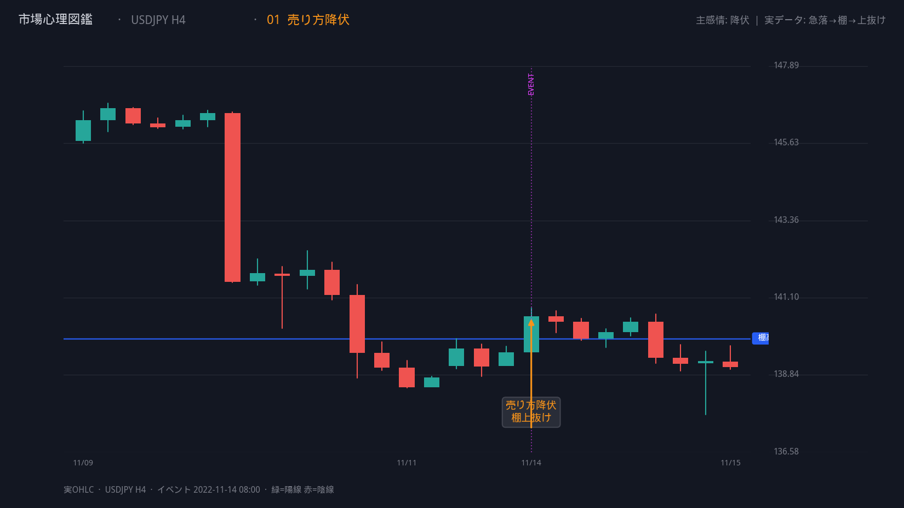
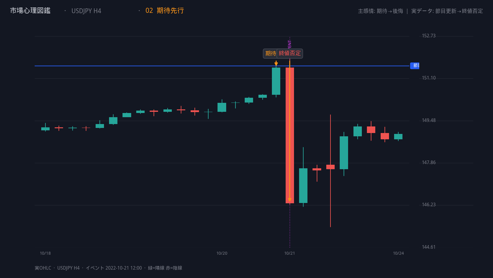
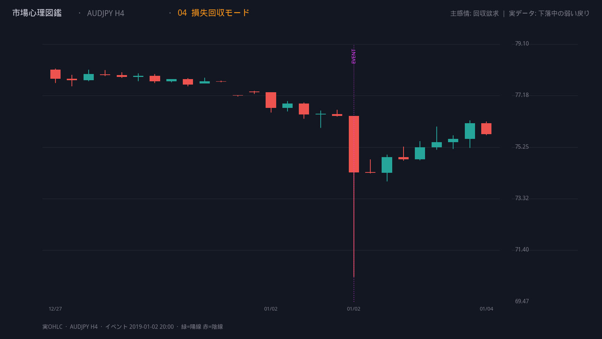
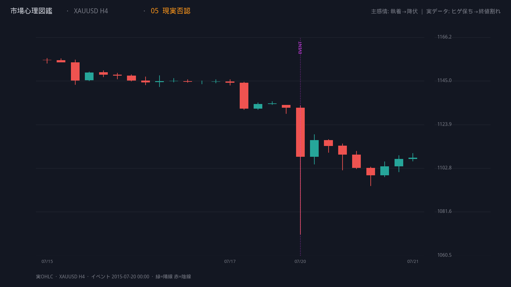
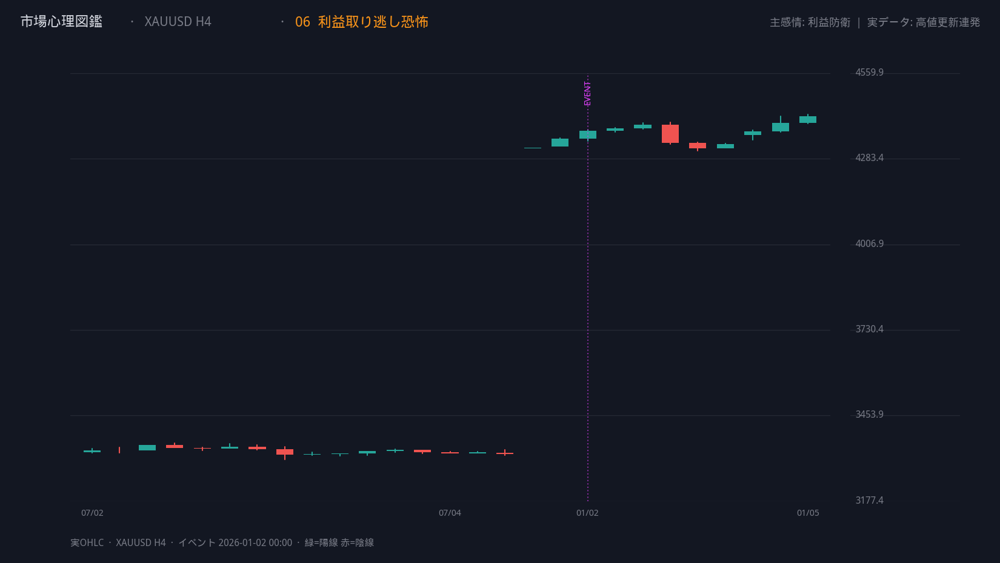
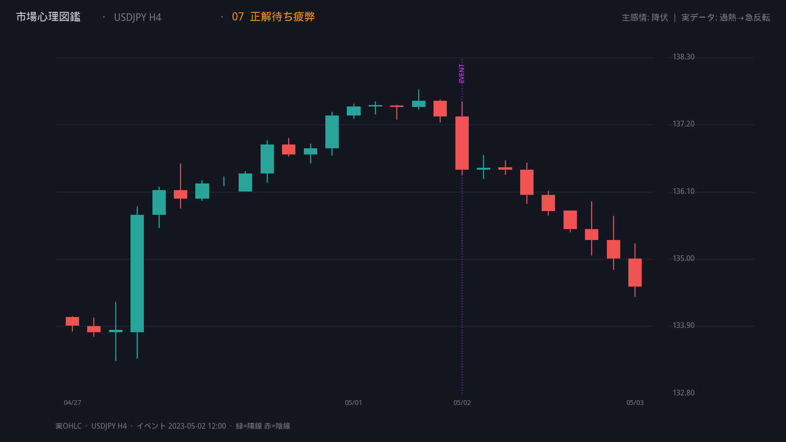
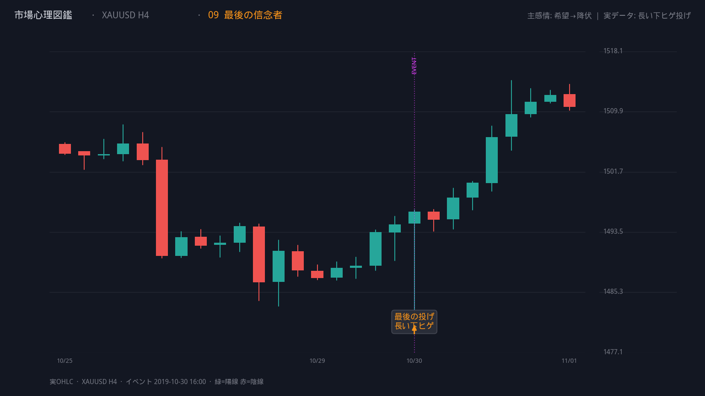
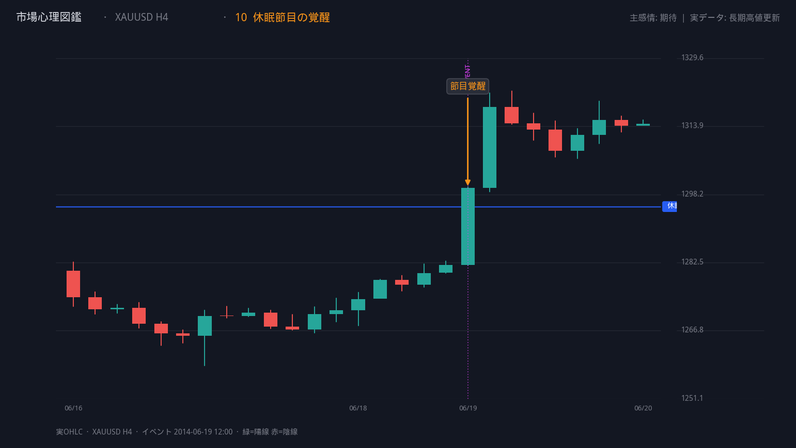
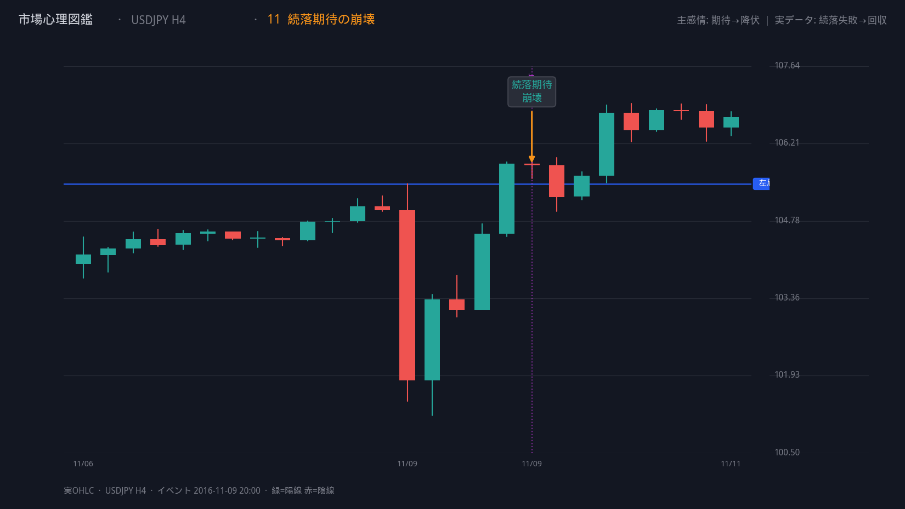
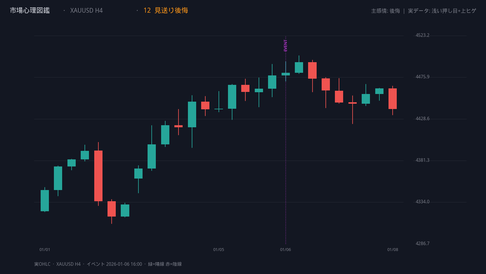

# 市場心理図鑑 — 実OHLCギャラリー

> [← 図鑑トップ](README.md) ／ [示意図ギャラリー](gallery.md) ／ [Vol.1 詳細](vol01_core_patterns.md)

H4 **実データ**からイベントを自動検出し、TradingView 風に切り出したチャート。

再生成手順は [SETUP_REAL_CHARTS.md](SETUP_REAL_CHARTS.md) を参照。

## 01 売り方降伏

- **通貨:** USDJPY H4
- **イベント時刻:** 2022-11-14T08:00:00
- **検出スコア:** 7.59

[Vol.1 詳細 →](vol01_core_patterns.md#01-売り方降伏)

---

## 02 期待先行

- **通貨:** USDJPY H4
- **イベント時刻:** 2022-10-21T12:00:00
- **検出スコア:** 7.74

[Vol.1 詳細 →](vol01_core_patterns.md#02-期待先行)

---

## 03 市場の迷い

- **通貨:** USDJPY H4
- **イベント時刻:** 2025-04-18T20:00:00
- **検出スコア:** 1.19

[Vol.1 詳細 →](vol01_core_patterns.md#03-市場の迷い)

---

## 04 損失回収モード

- **通貨:** AUDJPY H4
- **イベント時刻:** 2019-01-02T20:00:00
- **検出スコア:** 7.88

[Vol.1 詳細 →](vol01_core_patterns.md#04-損失回収モード)

---

## 05 現実否認

- **通貨:** XAUUSD H4
- **イベント時刻:** 2015-07-20T00:00:00
- **検出スコア:** 7.62

[Vol.1 詳細 →](vol01_core_patterns.md#05-現実否認)

---

## 06 利益取り逃し恐怖

- **通貨:** XAUUSD H4
- **イベント時刻:** 2026-01-02T00:00:00
- **検出スコア:** 2.97

[Vol.1 詳細 →](vol01_core_patterns.md#06-利益取り逃し恐怖)

---

## 07 正解待ち疲弊

- **通貨:** USDJPY H4
- **イベント時刻:** 2023-05-02T12:00:00
- **検出スコア:** 7.49

[Vol.1 詳細 →](vol01_core_patterns.md#07-正解待ち疲弊)

---

## 08 静寂の蓄圧

- **通貨:** XAUUSD H4
- **イベント時刻:** 2026-02-12T16:00:00
- **検出スコア:** 2.74

[Vol.1 詳細 →](vol01_core_patterns.md#08-静寂の蓄圧)

---

## 09 最後の信念者

- **通貨:** XAUUSD H4
- **イベント時刻:** 2019-10-30T16:00:00
- **検出スコア:** 1.76

[Vol.1 詳細 →](vol01_core_patterns.md#09-最後の信念者)

---

## 10 休眠節目の覚醒

- **通貨:** XAUUSD H4
- **イベント時刻:** 2014-06-19T12:00:00
- **検出スコア:** 1.00

[Vol.1 詳細 →](vol01_core_patterns.md#10-休眠節目の覚醒)

---

## 11 続落期待の崩壊

- **通貨:** USDJPY H4
- **イベント時刻:** 2016-11-09T20:00:00
- **検出スコア:** 5.36

[Vol.1 詳細 →](vol01_core_patterns.md#11-続落期待の崩壊)

---

## 12 見送り後悔

- **通貨:** XAUUSD H4
- **イベント時刻:** 2026-01-06T16:00:00
- **検出スコア:** 25.40

[Vol.1 詳細 →](vol01_core_patterns.md#12-見送り後悔)

---
