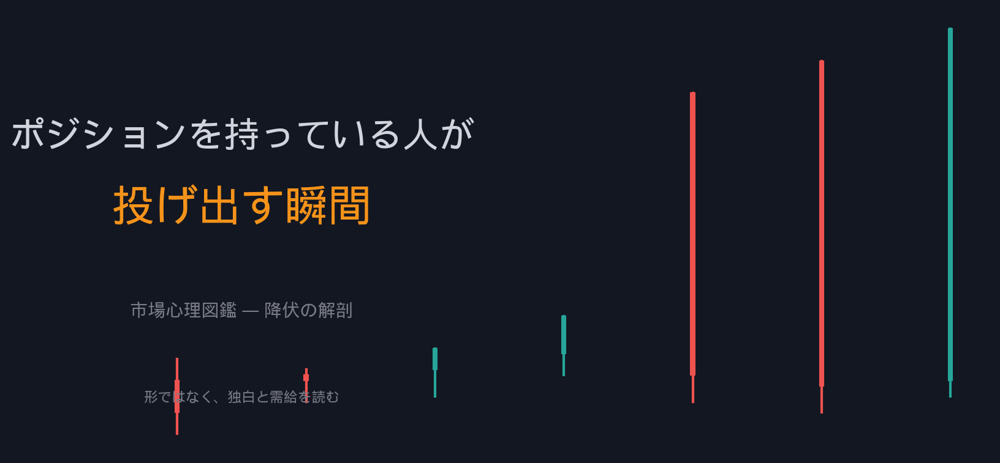
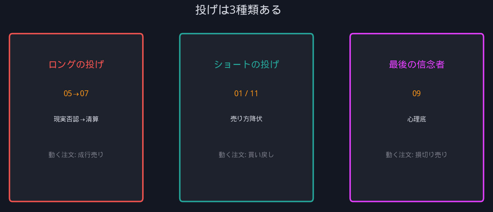
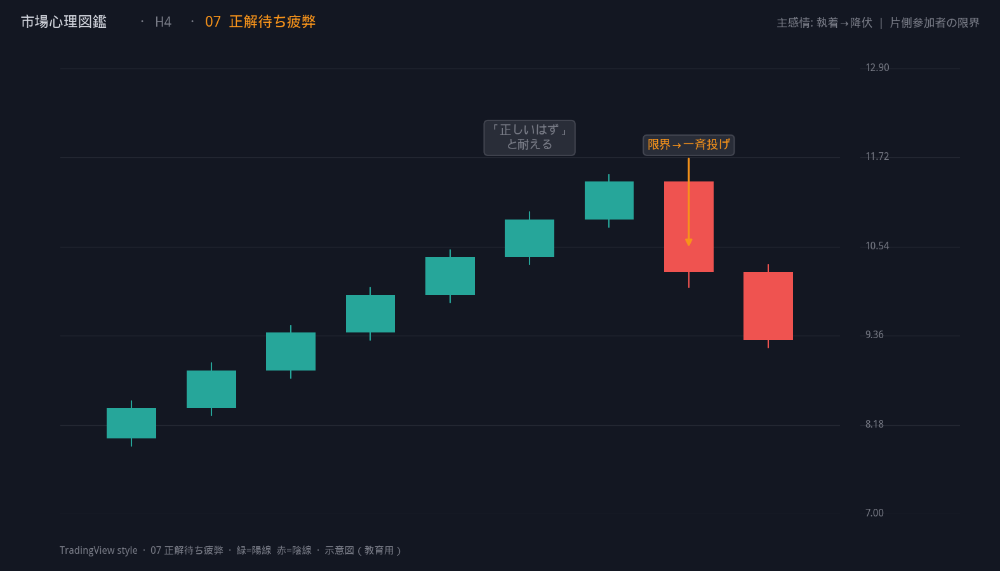
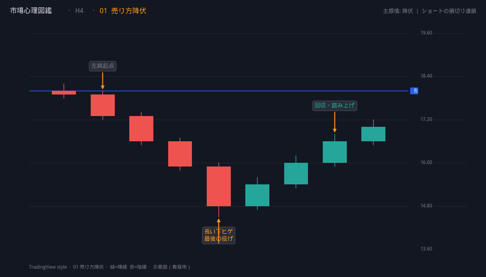
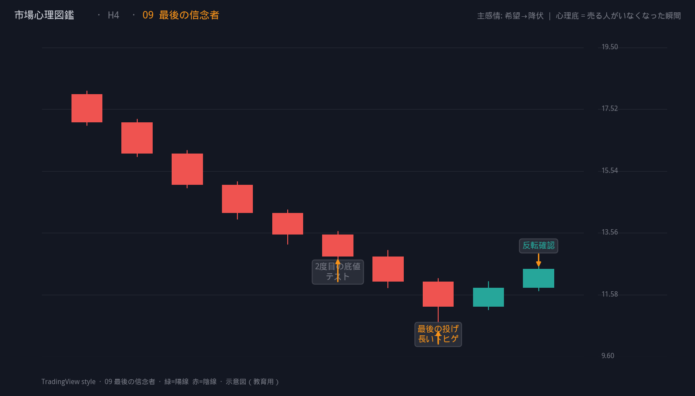
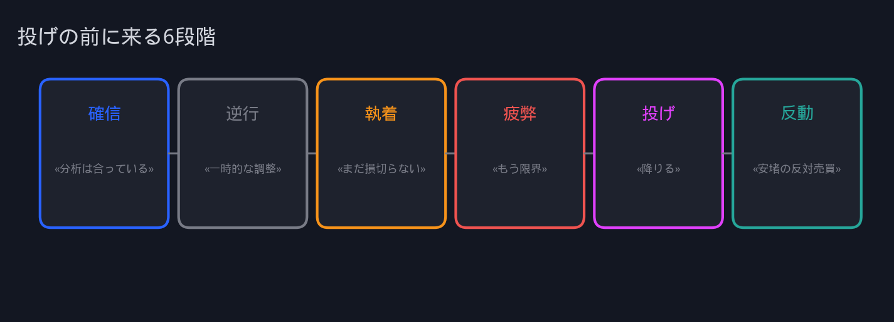
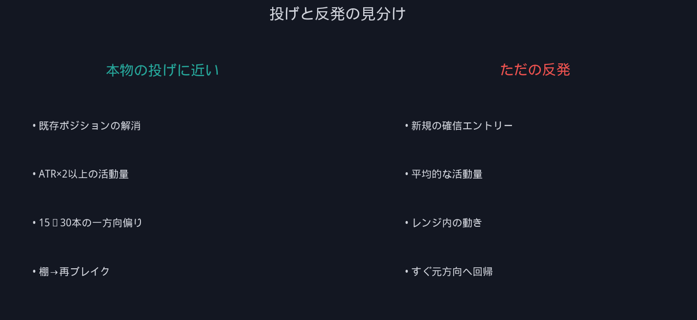
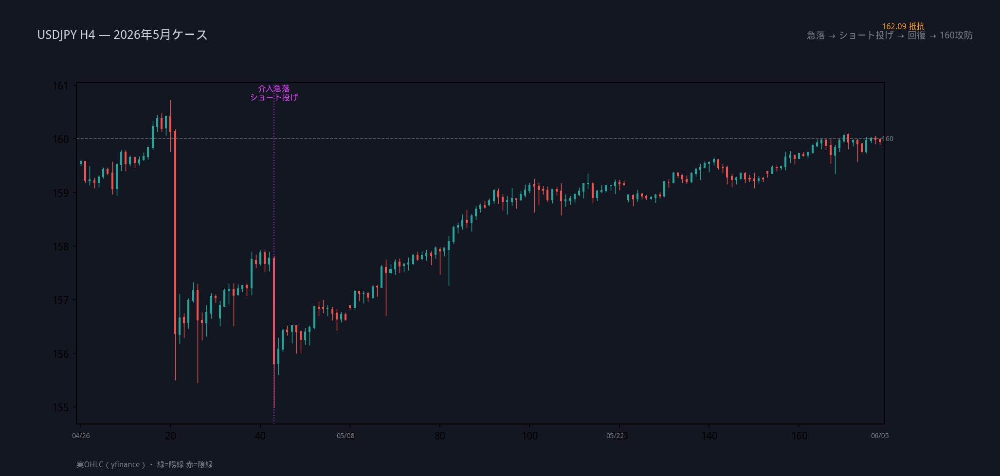

# ポジションを持っている人が投げ出す瞬間

**サブタイトル案:** ローソク足の形ではなく、降伏の心理を読む — 市場心理図鑑より

---

*Capitulation。Long Liquidation。投げ。*

チャート用語として聞こえるが、本当に起きているのはもっと単純だ。

**まだ信じていた人が、もう信じられなくなった瞬間。**

ローソク足はその結果を記録しているだけで、原因はいつも頭の中の独白にある。

---

*市場心理図鑑 — 形ではなく独白と需給を読む*

---

## 投げとは何か

| | |
|---|---|
| **投げ** | 含み損・含み益・分析・希望を手放し、反対方向の注文を出す瞬間 |
| **降伏** | 「自分は正しい」をやめ、現実に合わせて動くこと |
| **需給** | 新規の確信ではなく、**既存ポジションの解消**が価格を動かす |

投げは「安いから買う」「高いから売る」ではない。

**もう持っていられないから、売る（または買い戻す）。**

---

## 投げは3種類ある

同じ「投げ」でも、誰が・なぜ・どの方向に投げるかで需給はまったく違う。

*左: ロング清算 ／ 中: ショートカバー ／ 右: 最後の信念者*

---

### 1. ロングの投げ — 現実否認 → 清算

**独白:** «一時的な調整だ» → «まだ戻る» → «もう限界…降りる»

ロング保有者の売りが一方向に集中する。ファンダメンタルより先に、**ポジションの物理**が価格を押し下げる。

*図鑑 05｜ヒゲだけで節目を守る → 終値で割れた瞬間、希望が恐怖に切り替わる*

*図鑑 07｜一方向に偏った参加者が限界を迎え、投げが連鎖する*

---

### 2. ショートの投げ — 売り方降伏

**独白:** «まだ下がる» → «下がらない…困る» → «もう無理、買い戻す»

新規ロングの確信買いより、**ショートの損切り買い**が先に価格を押し上げる。

反転の第一声は「底が来た」ではなく、**「売り方が降参した」**。

*図鑑 01｜急落 → 棚 → 棚上抜け。買い戻し連鎖の典型*

---

### 3. 最後の信念者 — 心理底

**独白:** «ここが歴史的な底だ» → «まだ早い人がいる» → «信じていた自分がバカだった»

「底だ」と信じた層が最後まで残り、そこで一斉に売る。

ファンダメンタル底ではなく **心理底** — もう売る人がいなくなったあとに、本当の反転が始まりやすい。

*図鑑 09｜長い下ヒゲ + 活動量最大 → 次足で反転確認*

---

## 投げの前に必ず来る6段階

どのパターンでも、投げの直前にはほぼ同じ感情の順序がある。

**疲弊と投げの境目**が、トレーダーが最も見落とす。

チャートでは「まだトレンドが続いているように見える」のに、参加者の心理はすでに限界に達していることがある。

| 段階 | 状態 | 市場への影響 |
|---|---|---|
| 確信 | 分析は合っている | 逆方向ポジションが積み上がる |
| 逆行 | 一時的だ | 需給は拮抗、停滞 |
| 執着 | 損切りはまだ早い | 偽反発（損失回収モード） |
| 疲弊 | 時間と資金が尽きる | 限界資金が動く |
| 投げ | もう無理 | 一方向の注文集中 |
| 反動 | 安堵 + 新規 | 期待先行の罠になりやすい |

---

## 投げと「ただの反発」の見分け

**損失回収モード**の反発は「投げの前触れ」に見えて、まだ投げではないことが多い。

燃料が尽きたあとの **正解待ち疲弊** こそ、本番の投げに近い。

共通ルール:

> **投げ直後の動きは「反転の確信」ではなく「投げた側の安堵」で動いている。**

だから、投げ足1本目で逆張りするより、**投げ後の棚・再ブレイク**を待つ。

---

## ケーススタディ: USDJPY H4（2026年5月）

介入後の急落 → V字回復を、図鑑の言葉で読む。

*実OHLC H4。紫の縦線 = 介入急落付近。オレンジ = 162 抵抗*

| 時期 | 出来事 | パターン | 心理 |
|---|---|---|---|
| 5月初旬 | 160超 → 155付近へ急落 | 売り方降伏（初動） | ロング投げ + ショート優勢 |
| 5月中旬 | 155から急反発 | 01 + 11 合成 | **ショートの投げ** |
| 5月下旬 | 158〜157で揉み合い | 市場の迷い | WAIT |
| 6月初旬 | 159〜160へ回復 | 利益取り逃し恐怖 前段 | 利確と再参加が混在 |

**いまの位置づけ（6月初旬）**

- 5月のショート投げフェーズは**終了**
- 160前後は利確と節目ダマシの境界
- 162付近は新しい「期待先行」リスクゾーン

投げは過去に一度起きただけで終わらない。

**次の投げは、160付近のロングの利確か、162で入ったショートの投げか** — どちらの限界資金が先に動くか、という問いになる。

---

## 観察ルール（5つ）

1. **投げは「安い/高い」から起きない。** 「持てない」から起きる。
2. **投げ直後は逆張りより確認。** 第一声は降伏であり、確信ではない。
3. **疲弊を形で測るな。** 一方向偏り + 活動量 + 速度を見る。
4. **誰が今入っているかを問う。** 遅れて入った層が厚いとき、次の投げは近い。
5. **時間足を混ぜる。** D1の文脈 × H4の確認。

---

## まとめ

**ポジションを持っている人が投げ出す瞬間**とは、

分析・希望・プライドを手放し、**反対方向の注文**で現実に合わせる瞬間。

ローソク足の長いヒゲや大陽線は、その瞬間の結果にすぎない。

研究すべきは形ではなく、**その直前に何人が・どんな独白で・限界を迎えたか**。

---

**次回予告:** 時間軸の投げ — D1で耐えた人がH4で投げる瞬間

*この記事は「市場心理図鑑（Market Psychology Atlas）」研究プロジェクトの一部です。*
