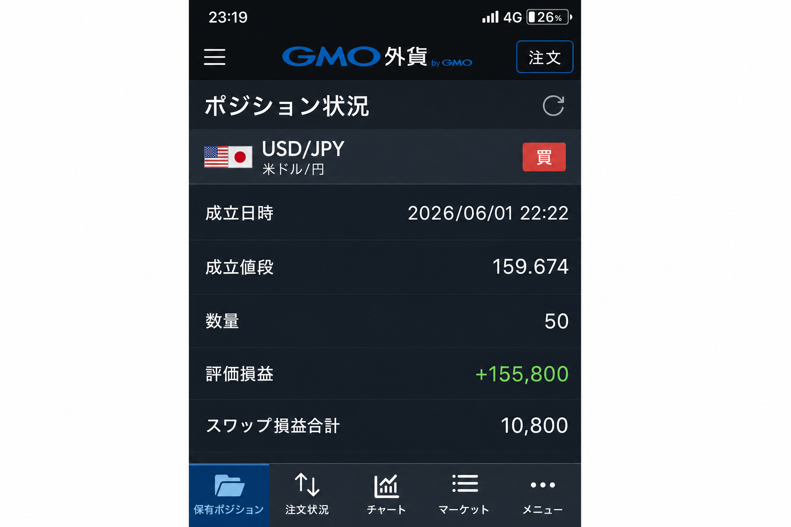
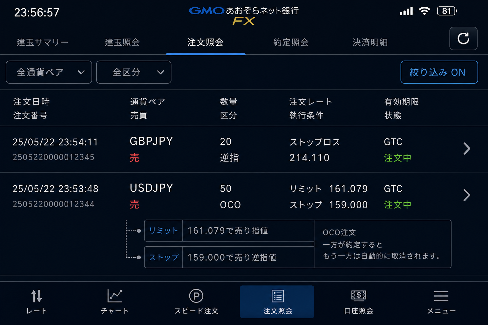

# 2026-06-01 USDJPY H4 買い — 4HT5シグナル点灯エントリー

[← 実践日誌](../README.md) ／ [← トレード日誌トップ](../../README.md)

## サマリー

| 項目 | 内容 |
|---|---|
| 日時 | 2026-06-01 22:22 (JST) |
| 銘柄 | USDJPY（米ドル/円） |
| 時間足 | H4（H4 T5 補助シグナル） |
| 方向 | 買い |
| 数量 | 50 |
| 建値 | 159.674 |
| エントリー理由 | **4HT5シグナル点灯エントリー** |
| ブローカー | GMOあおぞらFX |
| 状態 | 建玉中（記録時 評価損益 +155,800） |
| スワップ損益合計 | +10,800（記録時） |
| 決済注文 | **OCO** — 指値 **161.079** ／ 逆指 **159.000**（2026-06-06 23:56 発注） |
| 備考 | スクリーンショット取得 2026-06-01 23:19 |

## 写真

### 1. ポジション状況（GMOあおぞらFX）

- 成立 2026/06/01 22:22 @ **159.674**
- 記録時点の評価損益 **+155,800**、スワップ損益合計 **+10,800**

### 2. 決済注文 — OCO（2026-06-06 23:56）

| 項目 | 指値（利確） | 逆指（損切り） |
|---|---:|---:|
| 注文種別 | OCO指値 | OCO逆指 |
| 方向 | 売り | 売り |
| 数量 | 50 | 50 |
| 指定価格 | **161.079** | **159.000** |
| 建値との差 | +1.405（約 +140 pips） | -0.674（約 -67 pips） |

- 含み益 +15万超を**OCOで利確・損切りを同時に発注**。どちらか一方が約定すると他方は自動キャンセル。
- 6/3 ゴールド損失の教訓（含み益を返した）を受け、**指値で利確ラインを固定**。

## メモ

- 補助戦略 **H4 T5 + MACD + BB** のシグナル点灯を根拠にエントリー。
- 関連 Pine: [h4_t5_macd_bb_live_ready.pine](../../../pine/production/h4_t5_macd_bb_live_ready.pine)
- MTF 参考: [上位足押し目＝下位足転換](../../research/higher_tf_pullback_lower_tf_reversal_2026-06-08.md)（USDJPY 事例2）
- 決済後は [index.csv](../index.csv) の `status` と損益を更新する。
