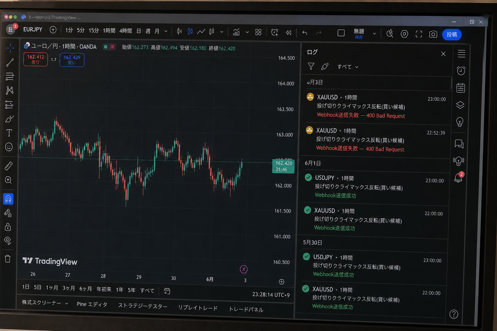
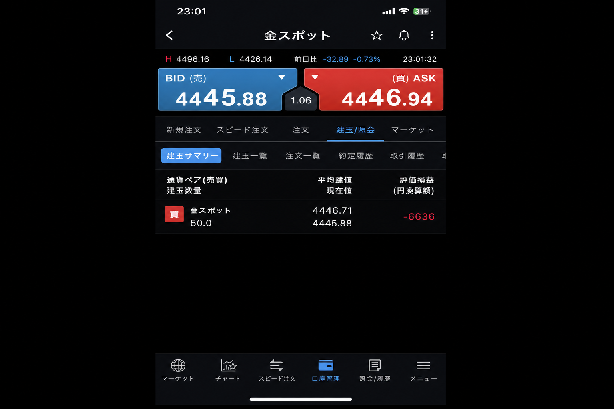
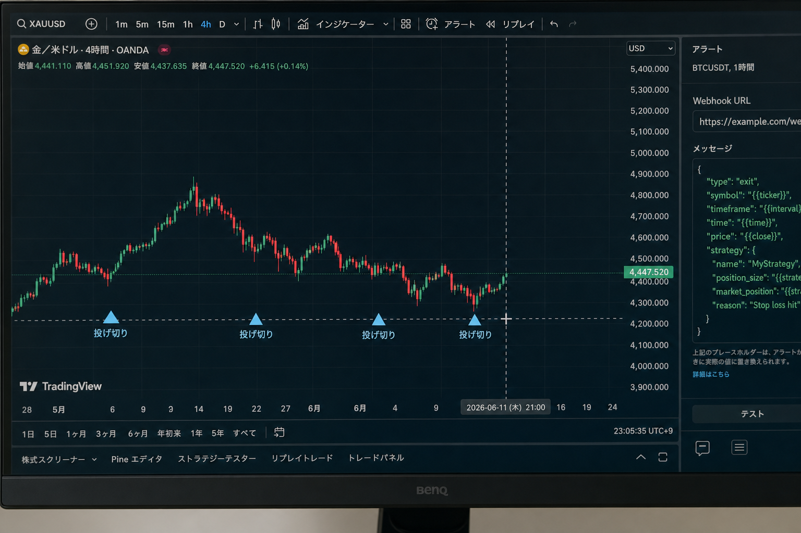

# 2026-06-03 XAUUSD H1 買い — 投げ切りシグナル → 損切り

[← 実践日誌](../README.md) ／ [← トレード日誌トップ](../../README.md)

## サマリー

| 項目 | 内容 |
|---|---|
| 日時 | 2026-06-03 23:01 (JST) |
| 銘柄 | XAUUSD（金スポット） |
| 時間足 | H1 |
| 方向 | 買い |
| 数量 | 50.0 |
| 建値 | 4446.71 |
| エントリー理由 | **投げ切りシグナル**（TradingView アラート鳴動） |
| アラート名 | 投げ切りクライマックス反転(買い候補) |
| 状態 | **損切り決済済み** |
| 結果 | 損切り |
| 備考 | TradingView webhook **400 Bad Request**（手動約定）。アラート発火 22:52 / 23:00 |

## 写真

### 1. TradingView アラートログ

- XAUUSD 1時間でアラートが2回（22:52 / 23:00）
- Webhook 送信失敗（400 Bad Request）→ 自動連携は未反映、手動で買い

### 2. 建玉サマリー（約定直後）

- 買い 50.0、平均建玉 4446.71
- 記録時点の現在値 4445.88、評価損益 -6,636

### 3. TradingView チャート（投げ切りマーカー）

- 現在値付近 **4,447.52**、直近の **投げ切り** マーカー（青三角）がエントリー根拠のチャート状況
- 5月高値（約4,800）からの下落後、6月にかけて底打ち・反発待ちの局面

## 決済

| 項目 | 内容 |
|---|---|
| 結果 | **損切り** |
| エントリー | 2026-06-03 23:01 @ 4446.71（買い 50.0） |
| 備考 | 反発待ちが続かず損切り。エントリー直後の評価損益は -6,636 |

## メモ

- **投げ切りシグナル（アラート鳴動）でエントリー** → **損切り**で終了。
- 投げ切り単独シグナルは、反転確認なしでは負けやすいケースとして記録。
