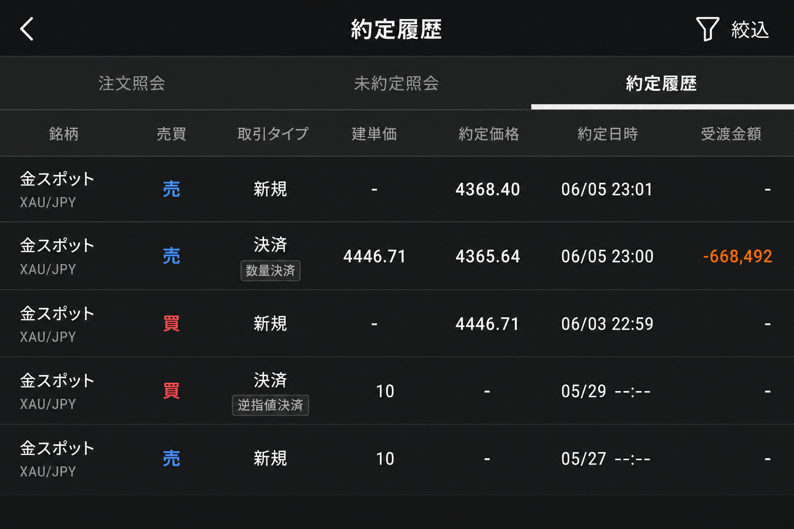

# 2026-06-03 XAUUSD H1 買い — 投げ切りシグナル → 損切り決済

[← 実践日誌](../README.md) ／ [← トレード日誌トップ](../../README.md)

## サマリー

| 項目 | 内容 |
|---|---|
| エントリー | 2026-06-03 22:59 @ **4446.71**（買い 50.0） |
| 決済 | 2026-06-05 23:00 @ **4365.64**（決済・成行） |
| 銘柄 | XAUUSD（金スポット） |
| 時間足 | H1 |
| エントリー理由 | **投げ切りシグナル**（TradingView アラート鳴動） |
| アラート名 | 投げ切りクライマックス反転(買い候補) |
| 状態 | **決済済み（損切り）** |
| 確定損益 | **-668,492 円** |
| 備考 | Webhook 400（手動約定）。アラート 22:52 / 23:00 |

## 写真

### 1. TradingView アラートログ

### 2. 建玉サマリー（エントリー直後）

- 記録時点の評価損益 -6,636

### 3. TradingView チャート（投げ切りマーカー）

### 4. 約定履歴（決済）

| 区分 | 日時 | 種別 | 建単価 | 約定価格 | 数量 | 受渡金額 |
|---|---|---|---:|---:|---:|---:|
| 新規 | 06/03 22:59 | 買い・成行 | 4446.71 | 4446.71 | 50.0 | — |
| **決済** | **06/05 23:00** | **売り・決済・成行** | 4446.71 | **4365.64** | 50.0 | **-668,492** |

## 決済サマリー

| 項目 | 値 |
|---|---:|
| 保有期間 | 約2日 |
| 価格差 | -81.07（4446.71 → 4365.64） |
| 確定損益 | **-668,492 円** |
| 結果 | 損切り |
| 背景 | **雇用統計**（指標日にロング保有） |

## 反省点

### 1. アラート音で入った

- 投げ切りの「形」より **アラートが鳴ったこと**がトリガー。
- Webhook 400 → 手動約定。エントリー直後から含み損（-6,636）だったのに、その場で整理しなかった。

### 2. 投げ切り単独買いは弱い

- 5月高値（約4,800）からの下落途中。反転確認（棚・再ブレイク）を待っていない。
- 研究メモでも **Capitulation 直買いは単独では保留** と記録済み。

### 3. 損切りが遅かった

- 約2日保有 → 成行決済で -81 ドル × 50 ロット相当。
- **SL を先に置かず**、含み損を抱えたまま指標日まで持ち越した。

### 4. 雇用統計の日にロングを抱えた

- 決済は **6/5 23:00**（雇用統計のボラティリティが出やすい時間帯）。
- 投げ切り＝「底打ち期待」の買いを、**指標前後の乱高下が出る局面**まで持ち越したのが損失拡大の一因。
- 指標日は新規エントリー禁止、既存ポジションは指標前に整理するルールが必要。

### 5. 次に守ること

| # | ルール |
|---|---|
| 1 | アラート音 ≠ エントリー → **STOP** で一度止まる |
| 2 | 投げ切りは **WAIT → CHECK**（反転確認後のみ） |
| 3 | **SL を先に置く**（成行損切りは最終手段） |
| 4 | **雇用統計など重要指標の前後は新規禁止・既存は整理** |

## メモ

- **投げ切りシグナル**でエントリー → **雇用統計**の局面で反発せず **06/05 成行決済**で損切り。
- 同型の GBPJPY 投げ切り（6/4）は、同じ轍を踏まないよう要監視。
