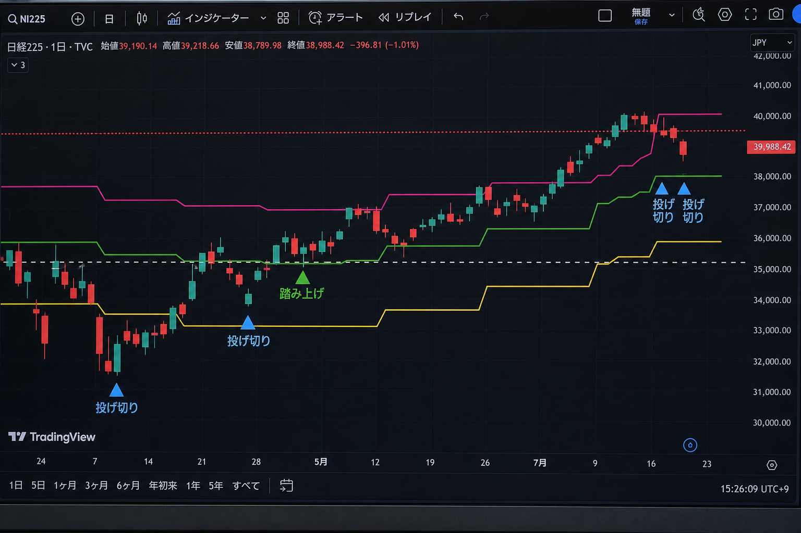
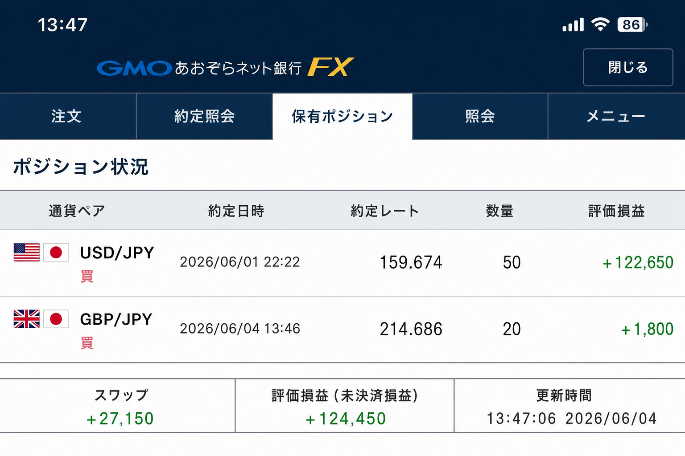

# 2026-06-04 GBPJPY 買い — 投げ切りシグナル

[← 実践日誌](../README.md) ／ [← トレード日誌トップ](../../README.md)

## サマリー

| 項目 | 内容 |
|---|---|
| 日時 | 2026-06-04 13:46 (JST) |
| 銘柄 | GBPJPY（英ポンド/円） |
| 時間足 | H4（市場心理・投げ切り検出） |
| 方向 | 買い |
| 数量 | 20 |
| 建値 | 214.686 |
| エントリー理由 | **投げ切りシグナル** |
| ブローカー | GMOあおぞらFX |
| 状態 | 建玉中（記録時 評価損益 +1,800） |
| 備考 | スクリーンショット 2026-06-04 13:47。同画面で USDJPY 買い50も保有中 |

## 写真

### 1. TradingView チャート（投げ切り・踏み上げマーカー）

- **投げ切り**（青三角）: 急落後の底付近で複数点灯
- **踏み上げ**（緑三角）: 5月中旬の売り方踏み上げ
- 黄/水色/ピンクのステップラインでレンジ・節目を確認してからエントリー

### 2. ポジション状況（GMOあおぞらFX）

| 通貨 | 成立 | 建値 | 数量 | 評価損益（記録時） |
|---|---|---:|---:|---:|
| **GBPJPY** | 06/04 13:46 | 214.686 | 20 | **+1,800** |
| USDJPY（同時保有） | 06/01 22:22 | 159.674 | 50 | +122,650 |

- 評価損益合計 **+124,450**、スワップ損益合計 **+27,150**（記録時）

## メモ

- 心理パターン **Capitulation（投げ切り）** に基づくロング。関連: [market_psychology_pattern_library](../../research/market_psychology_pattern_library_2026-05-30.md)
- 決済後は [index.csv](../index.csv) を更新する。
