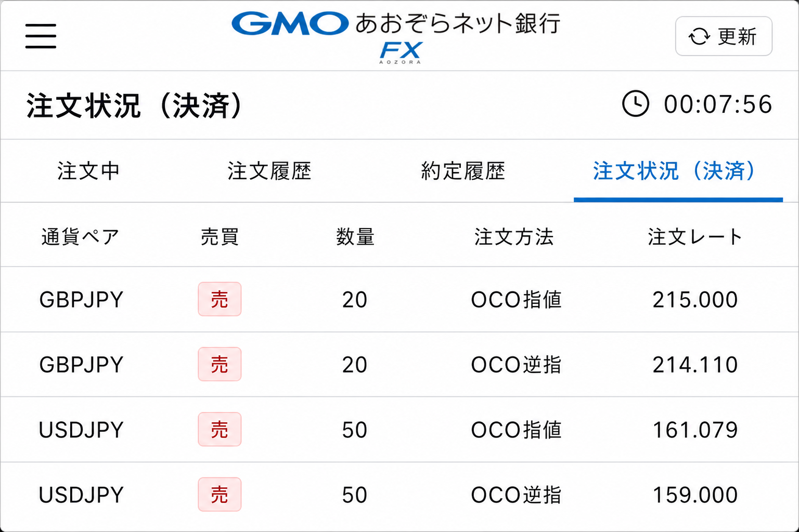
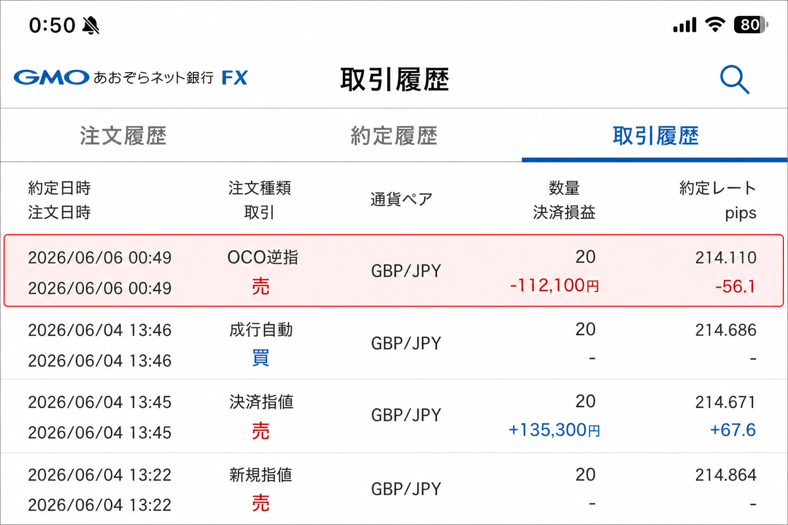

# 2026-06-04 GBPJPY 買い — 投げ切りシグナル

[← 実践日誌](../README.md) ／ [← トレード日誌トップ](../../README.md)

## サマリー

| 項目 | 内容 |
|---|---|
| 日時 | 2026-06-04 13:46 (JST) |
| 銘柄 | GBPJPY（英ポンド/円） |
| 時間足 | H4（市場心理・投げ切り検出） |
| 方向 | 買い |
| 数量 | 20 |
| 建値 | 214.686 |
| エントリー理由 | **投げ切りシグナル** |
| ブローカー | GMOあおぞらFX |
| 状態 | **決済済**（2026-06-06 逆指約定） |
| 決済 | **2026-06-06 00:49** @ **214.110**（OCO逆指） |
| 確定損益 | **-112,100 円**（GMO取引履歴） |
| 決済注文 | OCO 指値 215.000 ／ 逆指 214.110（06-07 00:07 発注） |
| 備考 | スクリーンショット 2026-06-04 13:47。同画面で USDJPY 買い50も保有中 |

## 写真

### 1. TradingView チャート（投げ切り・踏み上げマーカー）

- **投げ切り**（青三角）: 急落後の底付近で複数点灯
- **踏み上げ**（緑三角）: 5月中旬の売り方踏み上げ
- 黄/水色/ピンクのステップラインでレンジ・節目を確認してからエントリー

### 2. ポジション状況（GMOあおぞらFX）

| 通貨 | 成立 | 建値 | 数量 | 評価損益（記録時） |
|---|---|---:|---:|---:|
| **GBPJPY** | 06/04 13:46 | 214.686 | 20 | **+1,800** |
| USDJPY（同時保有） | 06/01 22:22 | 159.674 | 50 | +122,650 |

- 評価損益合計 **+124,450**、スワップ損益合計 **+27,150**（記録時）

### 3. 決済注文 — OCO（2026-06-07 00:07）

| 項目 | 指値（利確） | 逆指（損切り） |
|---|---:|---:|
| 注文種別 | OCO指値 | OCO逆指 |
| 方向 | 売り | 売り |
| 数量 | 20 | 20 |
| 指定価格 | **215.000** | **214.110** |
| 建値との差 | +0.314（約 +31 pips） | -0.576（約 -58 pips） |

- 06-06 23:56 に逆指のみ発注 → **00:07 にOCO指値 215.000 を追加**（USDJPYと同型）。
- 利確は H4 **20MA・整数節目**付近。投げ切り買いは大きく狙わず、**+3万円前後で機械的に利確**する設計。
- 6/3 ゴールド損失の教訓（含み益を返した）を受け、**指値で利確ラインを固定**。

## 決済（2026-06-06）

| 項目 | 内容 |
|---|---|
| 決済日時 | **2026-06-06 00:49** |
| 決済方法 | **OCO逆指値**（機械的損切り） |
| 約定価格 | **214.110** |
| 建値との差 | -0.576（約 -58 pips） |
| 確定損益 | **-112,100 円** |

### 4. 取引履歴（GMOあおぞらFX）

| 成立 | 種別 | 方向 | 数量 | 価格 | 損益 |
|---|---|---|---:|---:|---:|
| 06/06 00:49 | OCO逆指 | 売 | 20 | **214.110** | **-112,100** |
| 06/04 13:46 | 成行自動 | 買 | 20 | 214.686 | — |

- 節目 **214.1** を割り、事前に置いた逆指値どおりに決済。
- 6/3 ゴールドとは対照的に、**SL は発注済み** → 機械的損切りで終了（手仕舞いの遅れ・大損拡大は回避）。

## 反省点

| # | 内容 |
|---|---|
| 1 | **投げ切り単独で入った**（E01）— 棚・再ブレイクを待たずルール違反 |
| 2 | GBPJPY は研究上も **除外候補** — 同型の再現 |
| 3 | **良かった点:** OCO で SL/TP を発注し、損切りは機械的に実行できた |
| 4 | 入口はダメでも、**出口のルール遵守**で -11.2万で止まった（6/3 の -66.8万型は回避） |

## メモ

- 心理パターン **Capitulation（投げ切り）** に基づくロング。関連: [market_psychology_pattern_library](../../research/market_psychology_pattern_library_2026-05-30.md)
- MTF 気づき: [上位足押し目＝下位足転換](../../research/higher_tf_pullback_lower_tf_reversal_2026-06-08.md) — 本件は下位足転換未確認（E01）
- 決済後は [index.csv](../index.csv) を更新する。
