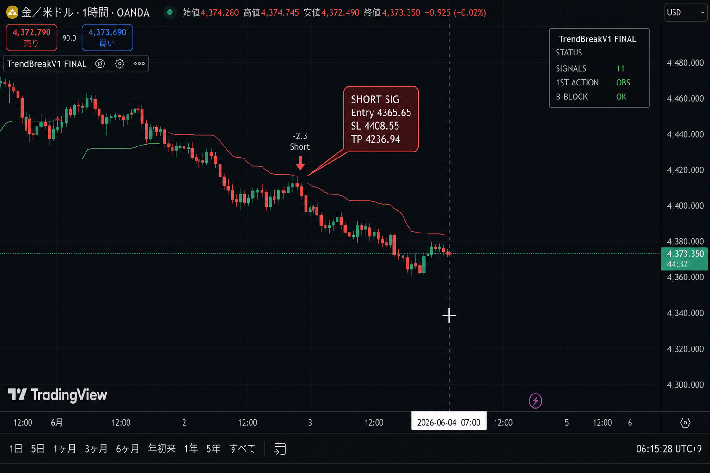
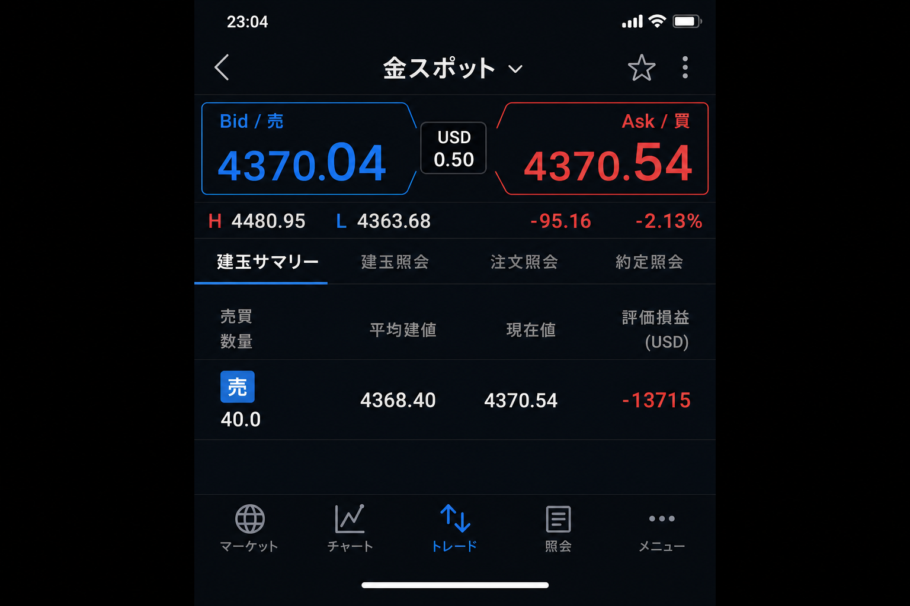
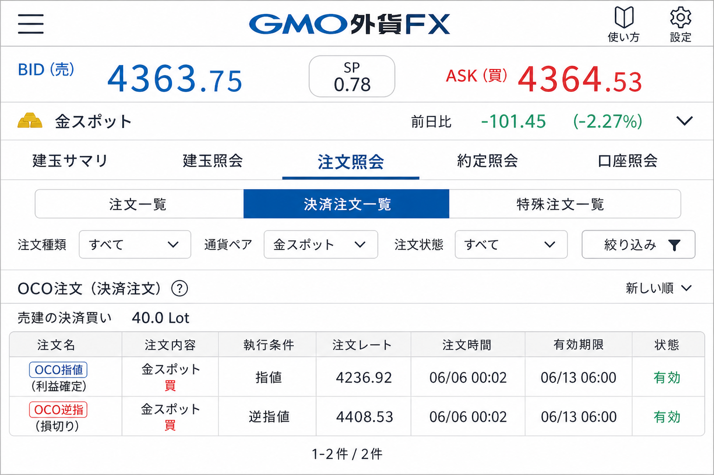

# 2026-06-04 XAUUSD H1 売り — V1ショートシグナル

[← 実践日誌](../README.md) ／ [← トレード日誌トップ](../../README.md)

## サマリー

| 項目 | 内容 |
|---|---|
| 日時 | 2026-06-04 07:00（シグナル）／ 約定建値 4368.40 |
| 銘柄 | XAUUSD（金スポット） |
| 時間足 | H1 |
| 方向 | **売り（ショート）** |
| 数量 | 40.0 |
| 建値 | 4368.40 |
| エントリー理由 | **V1ショートシグナル** |
| インジケータ | TrendBreakV1 [FINAL] |
| 状態 | 建玉中 |
| 決済注文 | **OCO** — 指値 **4236.92** ／ 逆指 **4408.53**（2026-06-06 00:02 発注、有効期限 06/13 06:00） |
| 備考 | スクリーンショット 23:04。シグナル時刻 07:00 |

## シグナル値（TradingView）

| 項目 | 価格 |
|---|---:|
| Entry (S) | 4365.65 |
| Stop Loss (SL) | 4408.55 |
| Take Profit (TP) | 4236.94 |
| ラベル | -2.3 Short |

## 写真

### 1. TradingView — TrendBreakV1 ショートシグナル

- H1 金/米ドル、連続陰線後の **SHORT SIG**
- ステータス: `signals 11` / `st action OBS B` / `Block OK`

### 2. 建玉サマリー（約定後）

- 売り 40.0、平均建玉 **4368.40**
- 記録時点の現在値 4370.54、評価損益 **-13,715**

### 3. 決済注文 — OCO（2026-06-06 00:02）

**記録時の相場**（00:02 付近）: BID **4363.75** / ASK 4364.53（前日比 **-101.45 / -2.27%**）

| 項目 | 指値（利確） | 逆指（損切り） |
|---|---:|---:|
| 注文種別 | OCO指値 | OCO逆指 |
| 方向 | 決済買（ショート手仕舞い） | 決済買（ショート手仕舞い） |
| 数量 | 40.0 | 40.0 |
| 指定価格 | **4236.92** | **4408.53** |
| 建値との差 | -131.48（利確方向） | +40.13（損切り方向） |
| シグナル値との差 | TP 4236.94 → **ほぼ一致** | SL 4408.55 → **ほぼ一致** |

- V1シグナルの SL/TP をそのまま **OCOで発注**。6/3ゴールド損失の教訓（SL未発注）を回避。
- ショート建玉のため、決済は**買い注文**（指値・逆指とも）。どちらか約定で他方は自動キャンセル。

## 保有中メモ（2026-06-06）

4300付近から4345へ戻り、**早期利確 vs OCO維持** で迷った。

| 検討 | 判断 |
|---|---|
| 早期利確 | 見送り |
| **採用ルール** | **V1 OCO 一本**（指値 4236.92 / 逆指 4408.53） |
| 理由 | 入る前に決めた出口。途中で相場観に書き換えない |

> 「上がってきた」は **主観**（E09/E04 的な不安）。4408 未触れ・TP未到達なら手を出さない。

## メモ

- 主力戦略 **TrendBreakV1 HYBRID** のショートシグナルに従ったエントリー。
- 関連 Pine: [TrendBreakV1_Final.pine](../../../pine/production/TrendBreakV1_Final.pine)
- 決済後は [index.csv](../index.csv) の `status` と損益を更新する。
