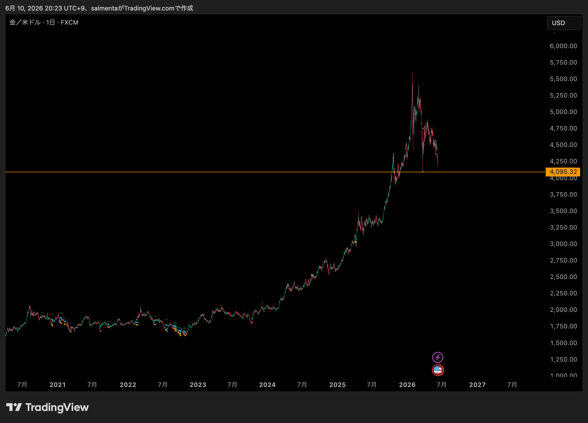
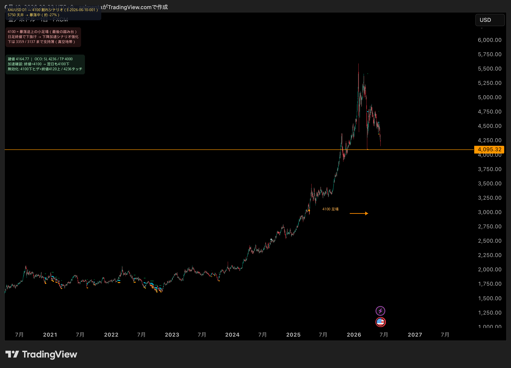

# 2026-06-10 XAUUSD H1 売り — 手法外（裁量ショート）

[← 実践日誌](../README.md) ／ [← トレード日誌トップ](../../README.md)

> **分類: 手法外取引** — 本命1 V1 / 本命2 H4 T5 / 本命v2.1 のいずれのシグナルも根拠としない。

## サマリー

| 項目 | 内容 |
|---|---|
| 日時 | 2026-06-10 19:28 (JST)（記録時スクリーンショット） |
| 銘柄 | XAUUSD（金スポット） |
| 時間足 | H1 |
| 方向 | **売り（ショート）** |
| 数量 | 50.0 |
| 建値 | **4164.77** |
| エントリー理由 | **手法外 — 裁量エントリー** |
| ブローカー | GMOあおぞらFX |
| 状態 | 建玉中（OCO 設定済み） |
| 評価損益（記録時） | **-4,492 円**（-56 pips）@ 19:28 |
| 備考 | V1 利確（4200）の約 10 時間後、更なる下落を追う形 |

## 手法外である理由

| チェック | 結果 |
|---|---|
| TrendBreakV1 SHORT SIG | ❌ なし |
| 本命v2.1 Matrix（Sqz/Cap/LL） | ❌ なし |
| H4 T5 + MACD + BB | ❌ なし |
| TradingView アラート | ❌ なし |
| 裁量判断 | ✅ チャート上の下落トレンド追随 |

**→ 研究・検証対象の正式シグナルではない。日誌上は「手法外」として別管理。**

## チャート状況（記録時）

| 項目 | 値 |
|---|---|
| 現在値（BID / ASK） | 4164.55 / 4165.33 |
| スプレッド | 0.78 USD |
| 当日高値 / 安値 | 4257.55 / 4155.43 |
| 当日変動 | -95.60（-2.24%） |
| SMA | 5 / 13 / 25 すべて下向き、価格は SMA 下 |
| 水平線 | 4329.58 付近（旧サポート/レジスタンス） |

## 裁量根拠（自己申告・推定）

- H1 で 4500 台から 4160 台への急落トレンド継続。
- 価格が SMA 5/13/25 の下で、移動平均が下向きに拡散（下降トレンド）。
- 同日朝 V1 ショートを **4200 で +109 万円利確** 後、更なる下落局面への再参入の可能性。

## OCO（GMOあおぞらFX）

| 項目 | 内容 |
|---|---|
| 注文種類 | OCO（決済） |
| 指値（利確） | **4000.00** |
| 逆指値（損切） | **4236.00** |
| 数量 | 50.0 |
| 設定日時 | 2026-06-10 19:31 (JST) |
| 有効期限 | 2026-06-20 02:00 |

### リスク計算（建値 4164.77 基準）

| 項目 | 値 |
|---|---:|
| SL 距離 | 71.23（4236.00 − 4164.77） |
| TP 距離 | 164.77（4164.77 − 4000.00） |
| リスクリワード | 約 **2.31R** |

※ 逆指値 4236 は、直前 V1 シグナル TP **4236.94** に近い水準。

## リスクメモ

| 項目 | 状態 |
|---|---|
| SL（逆指値） | ✅ **4236.00** 発注済み |
| TP（指値） | ✅ **4000.00** 発注済み |
| 6/3 教訓 | SL 発注済み → 6/3 投げ切り（SL 未発注）より改善 |

## 写真

### 1. GMO スピード注文 — 建玉・H1 チャート


- 建玉数量 50.0、平均レート **4164.77**
- 記録時 評価損益 **-4,492**（-56 pips）
- H1 SMA 5/13/25、下降トレンド

### 2. GMO 注文一覧 — OCO 決済


- 06/10 19:31 設定、有効期限 06/20 02:00
- ショート決済: 買い OCO × 50.0

### 3. TradingView — 日足（D1）4100 割れシナリオ

**生スクショ（incoming）**



**注釈付き（4100 割れシナリオ・OCO）**



- FXCM 日足、オレンジ **4095 / 4100** 付近の足場
- 左上: 仮説・真空地帯・建玉 OCO（SL 4236 / TP 4000）
- 2026-06-10 20:23 UTC+9 時点のスクショ

## 日足分析 — 4100 割れシナリオ（2026-06-10 記録）

### 仮説（原文）

> 下降の勢いが止まらない。日足 4100 直近安値付近を下抜けると、より下降勢いが強まる。

### 日足チャートからの修正・補強

| 観点 | 内容 |
|---|---|
| 4100 の位置づけ | 暴落途上の**小さな足場（一瞬の下げ止まり）**。本格的な日足スイング安値というより急落中の小休止 |
| 4100 下の構造 | **3359（オレンジ）・3137（白破線）** まで日足の厚い支持がほぼない → 「真空地帯」 |
| 修正した表現 | 「4100 直近安値」→ **「4100 暴落途上の最後の小さな足場。割れると 3359 まで支持が薄い」** |
| 総合評価 | 方向性・4100 下抜け加速シナリオは **条件付きで妥当**（**日足終値**確認が前提） |

### 4100 下抜けを「加速」と見る条件

1. **日足終値**が 4100 を明確に下（下ヒゲだけは不可）
2. 翌日以降も **4100 を戻せない**（再テスト失敗）
3. H4 で 4100 下に棚形成 → 再下落（戻り売り構造）
4. 出来高 / レンジ拡大（急落足）

### 仮説の無効化条件

| シグナル | 意味 |
|---|---|
| 4100 下ヒゲ → 終値 4100 上 | 投げ切り型ダマシ（6/3 型反発警戒） |
| 4100 割れ後 2〜3 日以内に終値 4100 上回復 | Trap / 支持線ダマシ |
| 4236 タッチ or 日足 2 本連続 4200 上 | 暴落一服・戻りシナリオ → SL 想定 |

### 価格マップ（日足）

```
5750  ─ パラボリック天井
  :
4200  ─ V1 利確ゾーン / SL 4236 付近
4164  ─ 建値（本トレード）
4100  ─ 暴落途上の小足場 ← 割れで加速シナリオ強化
4000  ─ OCO 指値 TP
3359  ─ 次の厚い日足支持（オレンジ線）
3137  ─ 更に下の歴史的節目（白破線）
```

### 運用ルール（本トレード向け）

```
【加速シナリオ確認】日足終値 < 4100 → 翌日も 4100 下 → OCO 維持、TP 4000 待ち

【無効化】日足 4100 下ヒゲ + 終値 4120 以上 → 投げ切り反発警戒

【撤退】4236 タッチ or 日足終値 > 4200 が 2 本 → 戻りシナリオ
```

※ 4100 割れは**保有継続の確認条件**。4100 手前（4166 付近）はまだ攻防中。

## 直前トレードとの関係

| トレード | 分類 | 建値 | 決済 | 損益 |
|---|---|---:|---:|---:|
| E-2026-06-04-002 | **V1 正式** | 4368.40 | 4200.00 指値 | **+1,091,277** |
| **本トレード** | **手法外** | 4164.77 | — | 建玉中 |

V1 で利益を取った後、**シグナルなし**で同方向（売り）に再エントリーしている点に注意。

## メモ

- 手法外取引は **フォワード検証・戦略評価の対象外**。
- 決済後は `status`・確定損益・SL/TP の有無を [index.csv](../index.csv) に追記する。
- 次回からはエントリー前に **STOP**（なぜ正式シグナルでないか）を 1 行書く。
