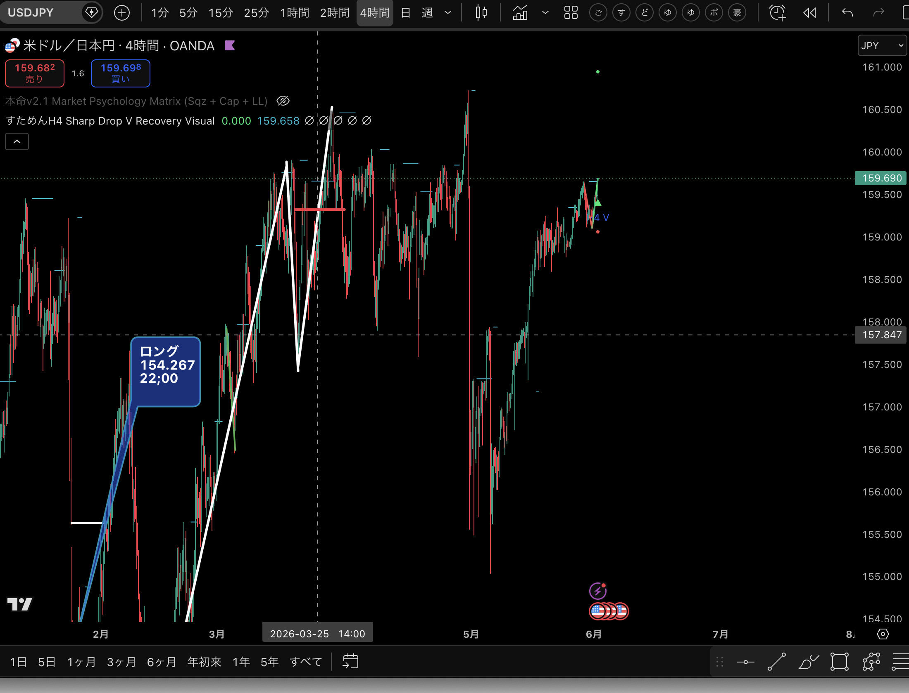

# TP-2026-06-01-001 USDJPY H4 159.674

作成日: 2026-06-01  
用途: 作成したインジケータの実践記録

## 概要

| 項目 | 内容 |
|---|---|
| 記録ID | TP-2026-06-01-001 |
| エントリー日時 | 2026-06-01 22:22 |
| 通貨ペア | USDJPY |
| 時間足 | H4 |
| エントリー価格 | 159.674 |
| 売買方向 | 未記入 |
| 状態 | 保有中 |
| 使用インジケータ | すためんH4 Sharp Drop V Recovery Visual |
| 補助表示 | 本命v2.1 Market Psychology Matrix |
| スクショ | [公開用チャート画像](../images/2026-06-01_usdjpy_h4_entry_159674_chart.png) |

## チャート画像

## エントリー時点のメモ

2026-06-01 22:22、作成したインジケータを見て、USDJPY H4で 159.674 にエントリー。

スクショ上では、価格は159.69付近。チャート右側にV字回復系の表示が出ており、インジケータの実戦確認として記録する。

画像は公開用にチャート部分を切り出したもの。元画像のローカルパスは記録しない。

## 翌朝の観察

2026-06-02 朝に確認したところ、エントリー時に点灯していたラベルが非点灯になっていた。

このため、このエントリーは通常の勝敗記録だけでなく、インジケータ挙動の検証対象にする。

| 観察項目 | 記録 |
|---|---|
| エントリー時 | ラベル点灯 |
| 翌朝確認時 | ラベル非点灯 |
| 仮説 | リペイント、または未確定足で一時点灯したラベルの可能性 |
| 次に確認すること | 確定足後もラベルが残る条件か、リアルタイムだけ点灯する条件か |
| 次回ルール候補 | ラベル点灯直後ではなく、足確定後も残るか確認してから判断する |

## 入る前に確認したい項目

| 確認項目 | 記録 |
|---|---|
| なぜこの価格で入ったか | 未記入 |
| どの表示を根拠にしたか | Sharp Drop V Recovery Visual |
| 直前のローソク足 | 未記入 |
| 上位足の方向 | 未記入 |
| 損切り位置 | 未記入 |
| 利確候補 | 未記入 |
| 入る前の感情 | 未記入 |
| S/W/C分類 | 未分類 |

## 決済後に追記すること

| 項目 | 記録 |
|---|---|
| 決済日時 | 未記入 |
| 決済価格 | 未記入 |
| 結果 | 未記録 |
| 決済理由 | 未記入 |
| 予定通りに損切りできたか | 未記入 |
| 途中で不安になったか | 未記入 |
| 入り直すならどこを待つか | 未記入 |
| 次回ルール | 未記入 |

## 研究メモ

この記録は、インジケータが実戦でどのように見えたかを確認するためのフォワード記録。

勝ち負けだけではなく、次を必ず見る。

- エントリー前に損切り位置が決まっていたか
- V字回復表示を見てすぐ入ったのか、次の足を待てたのか
- ラベルが足確定後も残るか、リアルタイムだけの一時表示だったか
- エントリー後に根拠を後から増やしていないか
- 同じ形が次に出たとき、再現できる判断だったか
