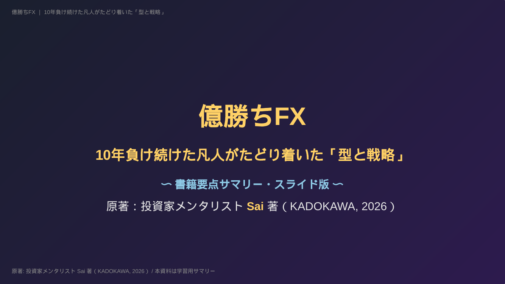
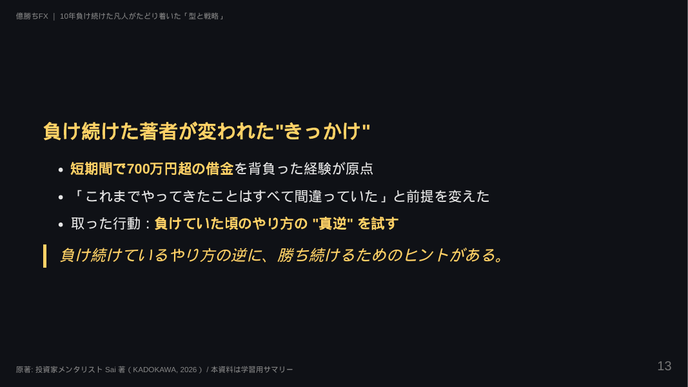

# 億勝ちFX スライド

書籍『億勝ちFX 10年負け続けた凡人がたどり着いた「型と戦略」』（投資家メンタリスト Sai 著, KADOKAWA, 2026）の **学習用要点サマリースライド**。

## プレビュー

| タイトル | 本文サンプル |
|---------|--------------|
|  |  |

## ファイル

| ファイル | 内容 |
|----------|------|
| `oku-gachi-fx.md` | Marp 形式の Markdown ソース（編集する場合はこちら） |
| `oku-gachi-fx.pdf` | プレゼン用 PDF（77ページ・16:9） |
| `oku-gachi-fx.html` | ブラウザ閲覧用 HTML（単体ファイル・スライド送り対応） |
| `oku-gachi-fx.pptx` | PowerPoint 形式（編集・印刷用） |

## 構成（章扉込み）

1. タイトル／本資料について
2. はじめに
3. **序章**：なぜ、あなたはFXで勝てないのか
4. **第1章**：700万円を失って摑んだ勝ちへの分岐点
5. **第2章**：シンプルこそ最強！億を生む Sai 式エントリーの設計図
6. **第3章**：資産を増やし続ける利確と損切りのルール
7. **第4章**：勝てない人が無意識に陥ってしまう「心の罠」とは？
8. **第5章**：勝ち続けるトレーダーに必要なマインドセット
9. **終章**：勝てるトレードは "仕組み" が9割
10. **巻末企画**：Sai 式 FX トレード 34 の鉄則
11. おわりに／読後アクションプラン

## ビルド方法

```bash
npm install
# HTML
npx marp oku-gachi-fx.md --no-stdin -o oku-gachi-fx.html
# PDF
npx marp oku-gachi-fx.md --no-stdin --pdf --allow-local-files -o oku-gachi-fx.pdf
# PowerPoint
npx marp oku-gachi-fx.md --no-stdin --pptx --allow-local-files -o oku-gachi-fx.pptx
# プレビュー（ローカルサーバ）
npx marp -s .
```

> PDF/PPTX 生成には Chromium が必要です（Marp CLI が自動でダウンロード）。

## 注意事項

- 本資料は学習目的の **要点要約** です。
- 具体的なチャート図・実例・詳細解説は原著を必ずご確認ください。
- 著作権は原著者・出版社に帰属します。再配布や商用利用は行わないでください。
