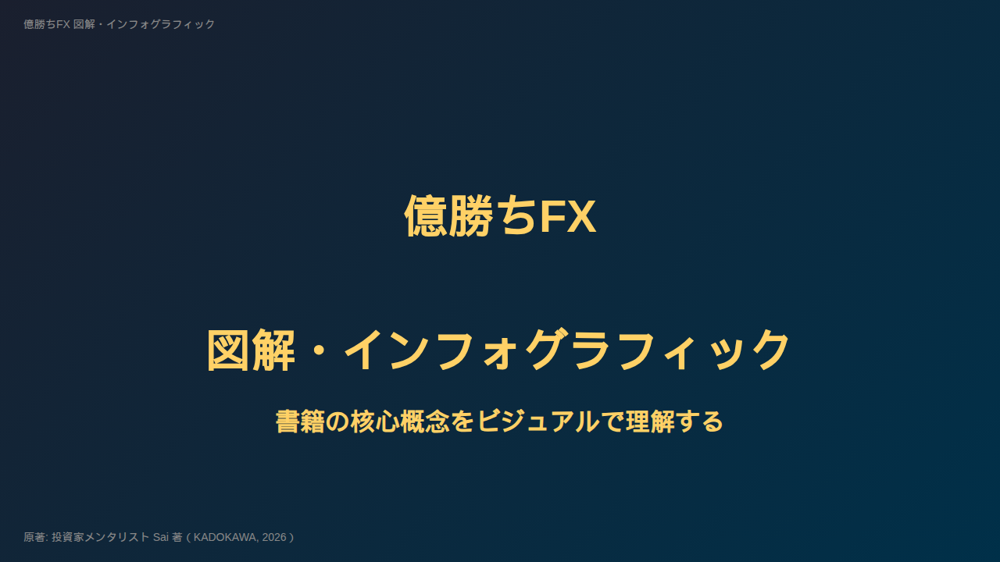

# 億勝ちFX スライド

書籍『億勝ちFX 10年負け続けた凡人がたどり着いた「型と戦略」』（投資家メンタリスト Sai 著, KADOKAWA, 2026）に基づくスライド資料。

## スライド一覧

| ファイル | 内容 | 枚数 |
|----------|------|------|
| `kate-nai-riyuu-simple.md` | **勝てない理由は驚くほど単純**（序章要点・単独テーマ） | 15枚 |
| `oku-gachi-fx.md` | **全章サマリー版**（はじめに〜34の鉄則） | 77枚 |
| `infographic-guide.md` | **図解・インフォグラフィック版**（9つの核心図 + フロー） | 15枚 |

## プレビュー

| 序章スライド | 全章サマリー | 図解・インフォグラフィック |
|-------------|-------------|---------------------------|
|  |  |  |

## 図解アセット（SVG）

`assets/` フォルダに9つの図解 SVG があります。他のスライドや資料でも再利用できます。

| ファイル | 内容 |
|----------|------|
| `01-majority-vs-minority.svg` | 大多数 vs 一握りの勝者 |
| `02-lose-first-win-remains.svg` | 負けを削って勝ちが残る |
| `03-entry-three-conditions.svg` | Sai式エントリー 3条件 |
| `04-stagnation-breakout.svg` | 停滞 → ブレイク |
| `05-bonus-time.svg` | ボーナスタイム理論 |
| `06-mental-method.svg` | メンタル × 手法 |
| `07-trend-following.svg` | 逆張り → 順張り |
| `08-evidence-ladder.svg` | 根拠の4段階 |
| `09-winning-system.svg` | 勝つべくして勝つ仕組み |

## ビルド方法

```bash
cd slides
npm install

# 序章スライド（勝てない理由は驚くほど単純）
npx marp kate-nai-riyuu-simple.md --no-stdin --pdf --allow-local-files -o kate-nai-riyuu-simple.pdf

# 全章サマリー
npx marp oku-gachi-fx.md --no-stdin --pdf --allow-local-files -o oku-gachi-fx.pdf

# 図解・インフォグラフィック
npx marp infographic-guide.md --no-stdin --pdf --allow-local-files -o infographic-guide.pdf
```

HTML / PPTX も同様に `--pdf` を `-o xxx.html` または `--pptx` に変えて生成できます。

## 原著 PDF

著者より依頼のあった原著 PDF はリポジトリ直下に含まれています。

- `億勝ちFX _最終チェック1218のコピー.pdf`

## 注意事項

- スライドは原著の要点を整理した学習用資料です。
- 詳細・チャート図解は原著をご参照ください。
- 著作権は原著者・出版社に帰属します。
