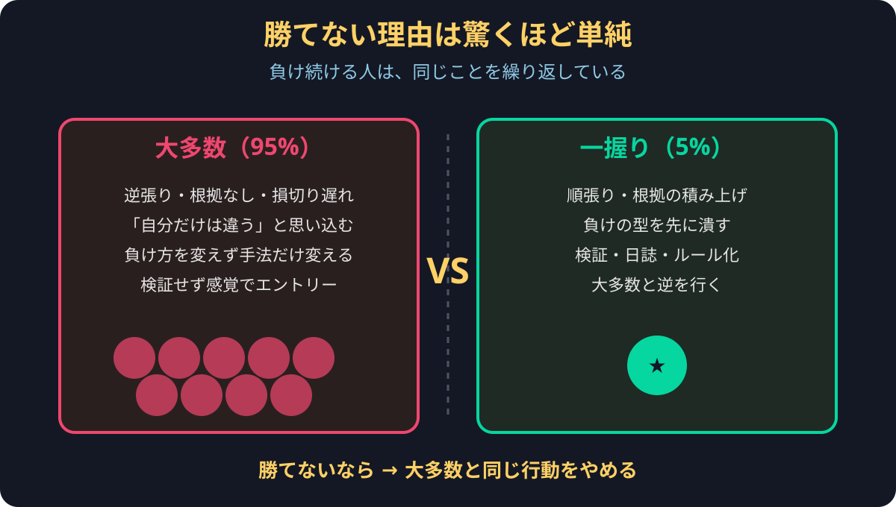
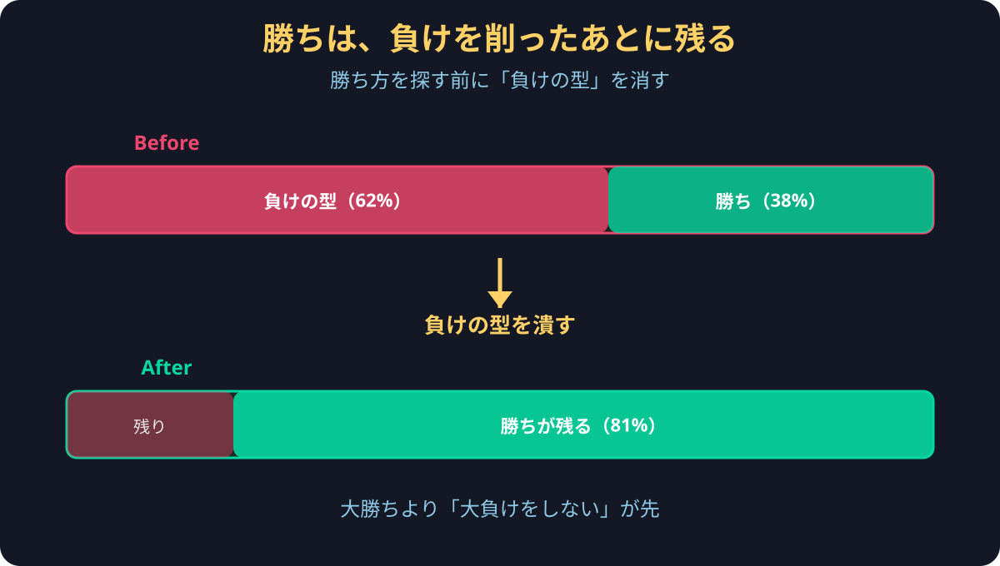
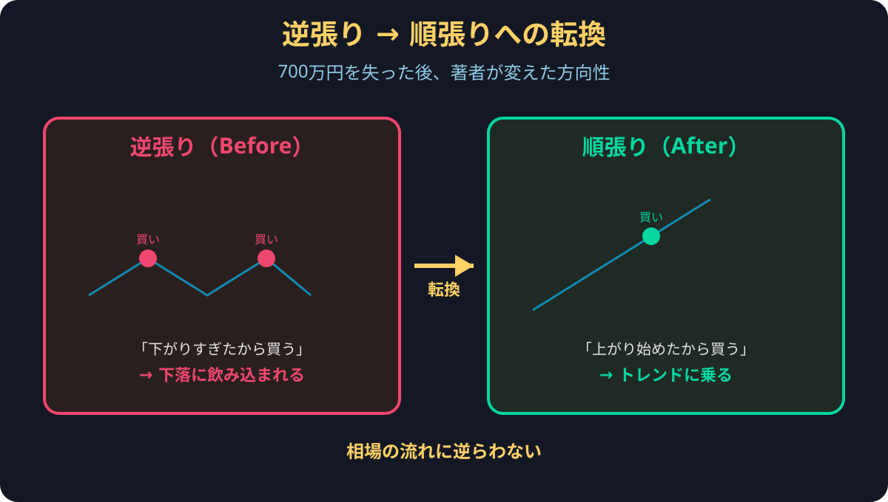
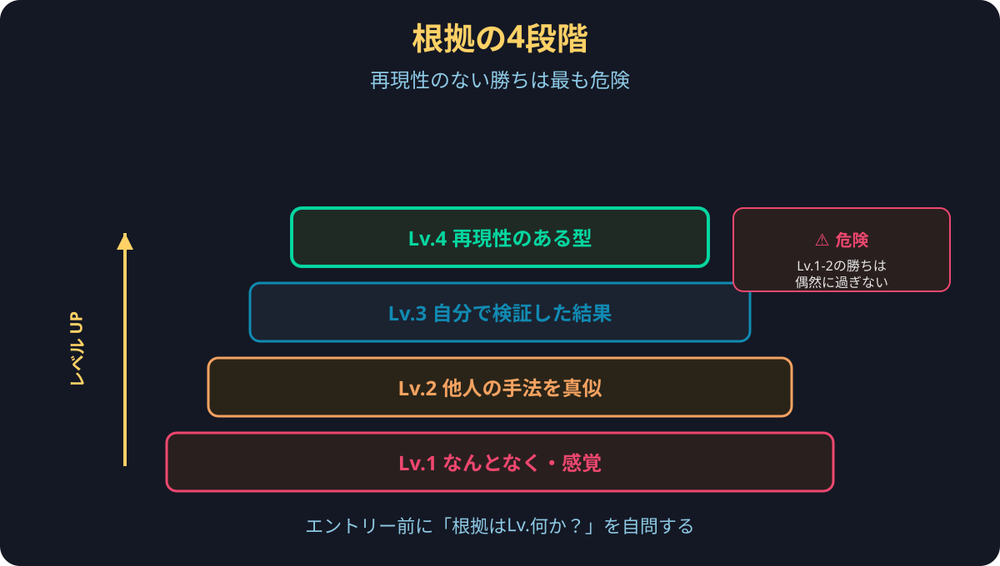
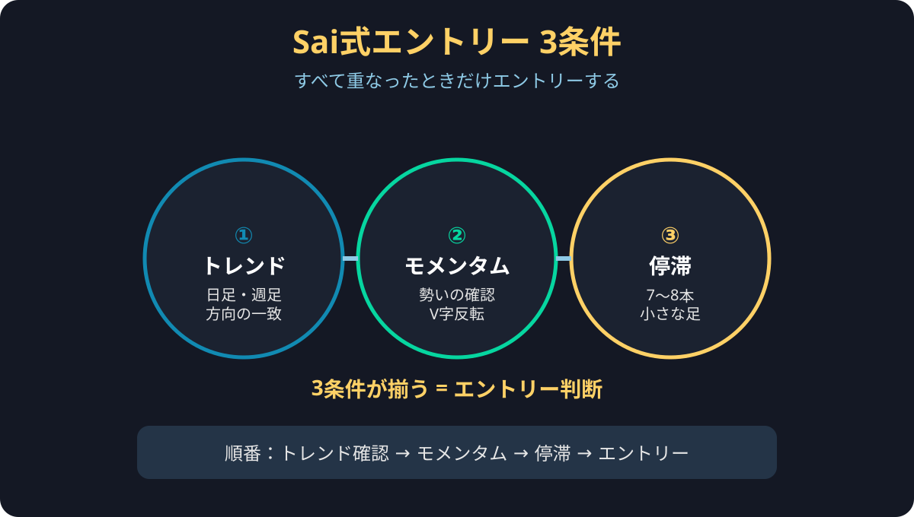
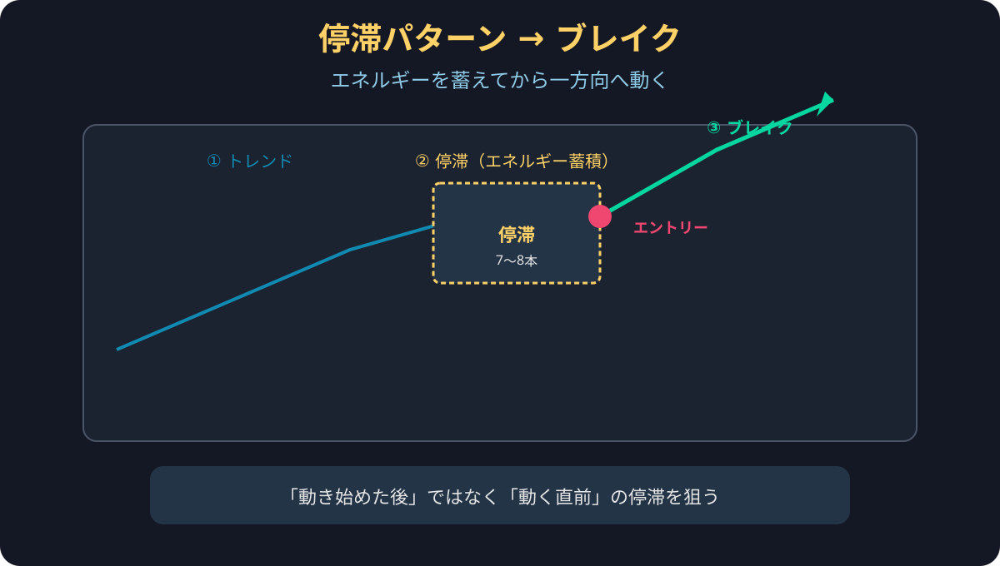
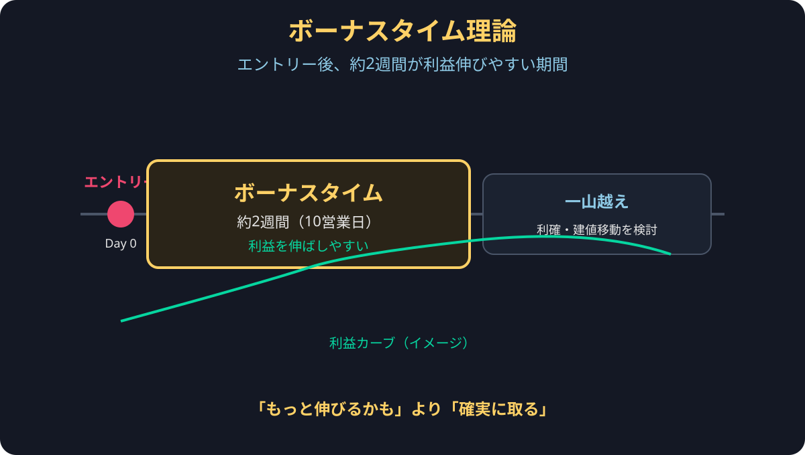
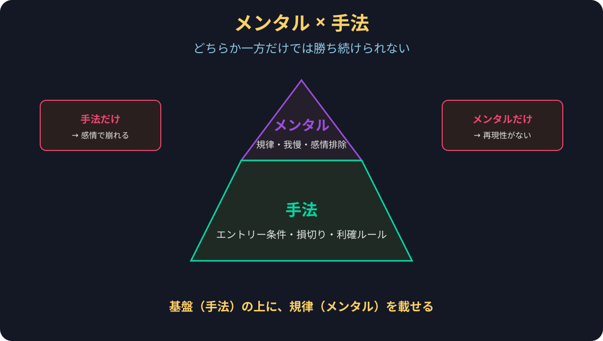
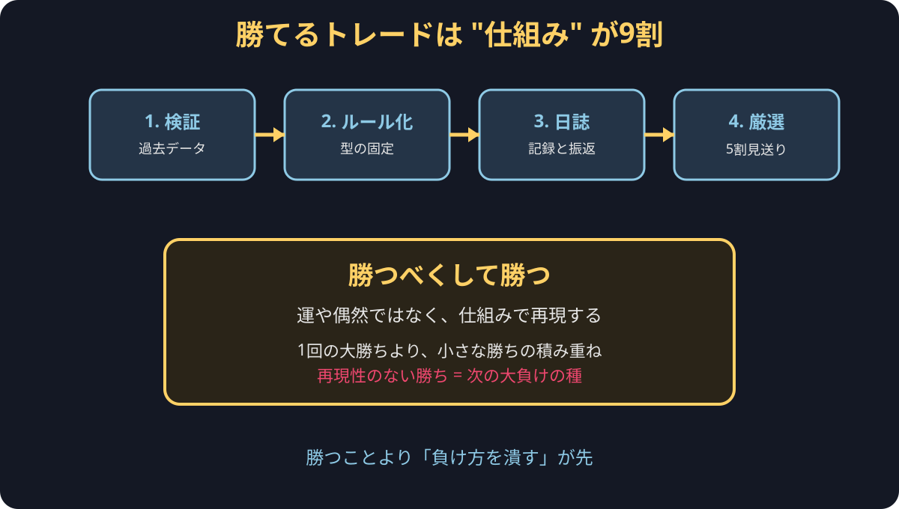

<!-- _class: title -->
<!-- _paginate: false -->

# 億勝ちFX
# 図解・インフォグラフィック

## 書籍の核心概念をビジュアルで理解する

---

## この資料について

<h3>目的</h3>

テキスト中心のスライドを<strong>図解・インフォグラフィック</strong>で補完し、要点を直感的に理解できるようにする

<h3>収録図解</h3>

序章・第1章・第2章・第3章・第5章・終章の<strong>9つの核心図</strong> + フローチャート

<h3>使い方</h3>

勉強会・セミナー・復習用。詳細は原著 PDF とテキストスライドを併用

<h3>関連ファイル</h3>

kate-nai-riyuu-simple.mdoku-gachi-fx.md

---

<!-- _class: infographic -->

# 01｜勝てない理由は驚くほど単純

## 大多数 vs 一握り

---

<!-- _class: infographic -->

# 02｜勝ちは、負けを削ったあとに残る

## 勝ち方を探す前に「負けの型」を消す

---

<!-- _class: infographic -->

# 03｜逆張り → 順張りへの転換

## 著者が700万円を失った後に変えた方向性

---

<!-- _class: infographic -->

# 04｜根拠の4段階

## 再現性のない勝ちは最も危険

---

<!-- _class: infographic -->

# 05｜Sai式エントリー 3条件

## トレンド × モメンタム × 停滞

---

<!-- _class: infographic -->

# 06｜停滞パターン

## エネルギーを蓄えてからブレイク

---

<!-- _class: infographic -->

# 07｜ボーナスタイム理論

## エントリー後、約2週間が利益伸びやすい期間

---

<!-- _class: infographic -->

# 08｜メンタル × 手法

## どちらか一方だけでは勝ち続けられない

---

<!-- _class: infographic -->

# 09｜勝てるトレードは "仕組み" が9割

## 検証 → ルール化 → 日誌 → 厳選

---

## 勝てない人の変化フロー

  
同じ行動 を繰り返す

  
→

  
「例外だ」 と思い込む

  
→

  
立ち止まる

  
→

  
勝者を学ぶ

  
→

  
やり方を改める

  
→

  
検証と日誌

---

## 34の鉄則：5テーママップ

  
<h3>思考</h3>
負け方潰し 自責思考 例外幻想

  
<h3>エントリー</h3>
順張り 停滞 V字

  
<h3>出口</h3>
一山 ボーナスタイム 損切り

  
<h3>環境</h3>
広い画面 ニュース距離 取引しない

  
<h3>仕組み</h3>
検証 日誌 再現性

---

<!-- _class: title -->
<!-- _paginate: false -->

# 図解で掴んだら

## 次は実践：検証 → 日誌 → 小ロット

### 原著『億勝ちFX』と併せて学習してください
